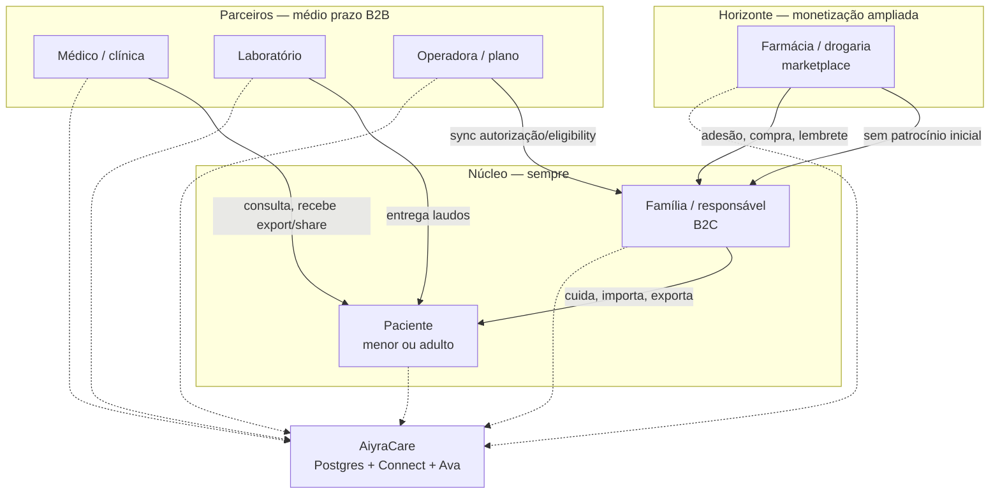
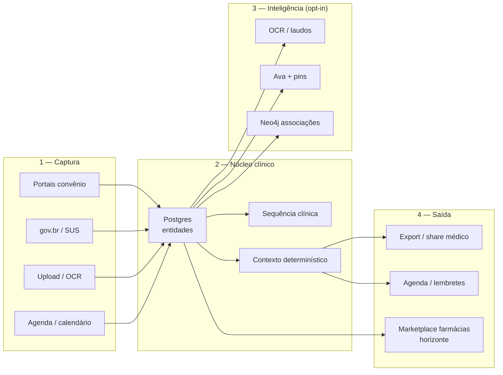
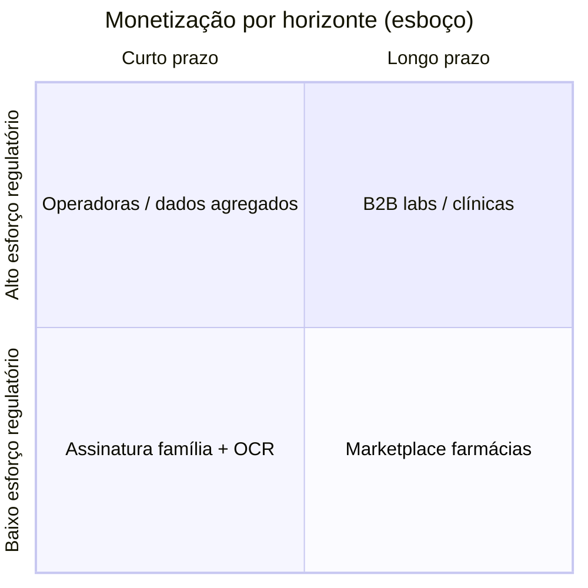
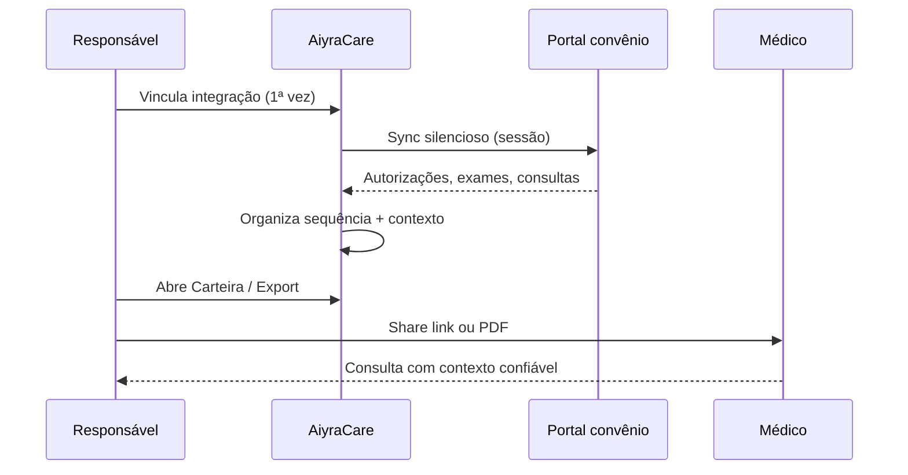
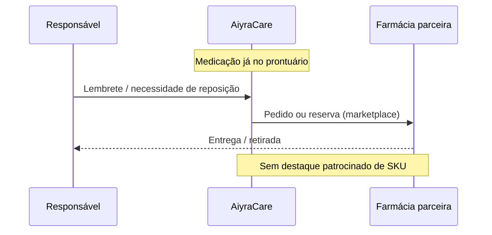

# Ecossistema AiyraCare — personas, valor e plano de negócio

> **Última atualização:** 2026-09-02  
> **Nota:** prioridades P0–P4 no roadmap **organizam temas** — não são uma fila rígida de execução.  
> Complementa: [`B2B_PARTNERS.md`](./B2B_PARTNERS.md), [`roadmap.json`](./roadmap.json).

## Visão em uma frase

**AiyraCare** é a camada familiar que **organiza** histórico clínico disperso (planos, labs, SUS, documentos) com **mínimo esforço manual** — e, no horizonte, conecta **parceiros** que participam do cuidado (médicos, labs, operadoras, farmácias) sem substituir o prontuário oficial.

---

## Mapa de personas

| Persona | Relação com Aiyra | Valor que recebe | Monetização Aiyra (fases) |
|---------|-------------------|------------------|---------------------------|
| **Responsável (B2C)** | Cliente principal hoje | Carteira unificada, sync, export, agenda, Ava | Assinatura família + créditos manuscrito/OCR |
| **Paciente** | Titular dos dados (menor: via responsável) | Histórico centralizado | Indireto (via família) |
| **Médico / clínica** | Parceiro B2B | Contexto na consulta, share seguro, timeline | Seat clínica / API (futuro) |
| **Laboratório** | Parceiro B2B | Canal de entrega estruturada de laudos | Fee por import ou SaaS lab |
| **Operadora** | Fonte de dados (sync) + parceiro regulado | Menos ligação do beneficiário; dados já no app família | Contrato B2B (discovery legal) |
| **Farmácia / drogaria** | Persona horizonte | Alcance a famílias com contexto de medicação | **Marketplace** (comissão/transação), **sem** patrocínio editorial inicial |

---

## Onde Aiyra agrega valor (camadas)

**Princípio:** dados clínicos estruturados no Postgres; Neo4j só associações; resumo para consulta **sem inventar com LLM**.

---

## Modelo de negócio (esboço)

| Fase | Foco | Dependências |
|------|------|--------------|
| **Agora (pré-CNPJ)** | Produto família, sync, ops, ambientes, docs ecossistema | Estruturação técnica; **sem** cobrança live |
| **Go-live B2C** | Stripe live, compliance, onboarding self-service | CNPJ, NFS-e, pareceres `human-review-gates` |
| **B2B piloto** | Export médico++, lab inbound API, 1 clínica + 1 lab | Org/RBAC, contratos B2B |
| **Marketplace farmácias** | Catálogo med + lembretes + checkout/rede credenciada | Sem patrocínio: lista neutra; LGPD + gate médico em recomendações |

### Marketplace farmácias (horizonte)

- **Não é** patrocínio de produto nem recomendação clínica automática no MVP do marketplace.
- **É** um **grupo de personas** adicional: família encontra farmácia/drogaria para **adesão, reposição ou compra** com contexto de medicação já no app.
- Receita possível: comissão sobre transação, fee de parceiro, ou assinatura para rede de lojas — **discovery** em [`B2B_PARTNERS.md`](./B2B_PARTNERS.md).

---

## Fluxo de valor — família (hoje)

---

## Fluxo de valor — horizonte farmácia

---

## Relação com outros documentos

| Doc | Conteúdo |
|-----|----------|
| [`PROJETO.md`](./PROJETO.md) | Produto vivo, integrações |
| [`B2B_PARTNERS.md`](./B2B_PARTNERS.md) | Segmentos B2B + marketplace |
| [`CONNECT.md`](./CONNECT.md) | Captura de portais |
| [`infra/ENVIRONMENTS.md`](./infra/ENVIRONMENTS.md) | Dev / staging / prod |
| [`LEGAL_COMPLIANCE.md`](./LEGAL_COMPLIANCE.md) | LGPD, click-wrap B2C vs contrato B2B |
| [`BILLING.md`](./BILLING.md) | Stripe, pacotes família |

---

## Próximos passos (produto / negócio)

1. Validar mapa com 2–3 conversas (pediatra, familiar beta) — **não bloqueia código**.
2. Piloto B2B clínico + lab antes de marketplace.
3. Marketplace farmácias: discovery regulatório (ANVISA, propaganda) + UX neutra.
