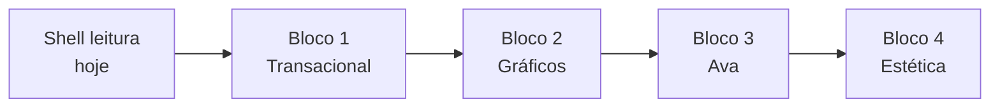

# App mobile — blocos de evolução (2026)

> **Decisão de sequência:** entregar em **quatro blocos fechados**, nesta ordem — sem misturar gráficos, Ava avançada ou redesign visual dentro do bloco transacional.
>
> Referências: [`MOBILE_WEB_DUAL_DELIVERY.md`](./MOBILE_WEB_DUAL_DELIVERY.md) · [`features/mobile-app-shell.md`](./features/mobile-app-shell.md) · [`testing/BUSINESS_ACTION_MATRIX.md`](./testing/BUSINESS_ACTION_MATRIX.md) · épico `plat-mobile` em [`roadmap.json`](./roadmap.json).

## Onde estamos hoje

| Fase concluída / em curso | Conteúdo |
|---------------------------|----------|
| **Shell M2–M6 (leitura)** | Auth, lista, perfil, tabs read-only (carteira, exames, meds, vacinas, alergias, atendimentos, agenda, integrações status), família/compliance, Ava chat básico + dock |
| **Em PR** | [#66](https://github.com/RafaDru/aiyra-care/pull/66) settings/telemetria/Ava markdown · [#67](https://github.com/RafaDru/aiyra-care/pull/67) leitura clínica |
| **Bloco 1 em curso** | Branch `cursor/mobile-bloco1-tx-a5c1` — autorizações/diagnósticos read-only; **alergias CRUD** + `FormSheet` |

**Próximo passo dentro do Bloco 1:** export/registro rápido, integrações (criar link); convênios vinculados seguem via sync/web. (Paciente, documentos, família TX em `cursor/mobile-bloco1-tx-a5c1` / PR #68.)

---

## Bloco 1 — Funcionalidades transacionais (`mobile-tx`)

**Objetivo:** no app, o titular/cuidador executa **ações de negócio** (criar, editar, excluir, convidar, sincronizar onde for viável) com a **mesma API** do web, sem depender do navegador — salvo [exceções explícitas](#exceções-permanentes-fora-do-bloco-1).

**Critério de saída do bloco:** cada linha da matriz abaixo com suite QA mobile (ou extensão da `mobile-shell-smoke` → suites por domínio) em **PASS** no device; feature card `mobile-app-shell` atualizada; nenhuma tab crítica ficar só com «Abrir no navegador» por falta de implementação (link web pode permanecer como atalho).

### 1.1 Conta, onboarding e pacientes

| Ação (web) | Mobile alvo | Suite / nota |
|------------|-------------|--------------|
| Onboarding titular + dependentes | Formulários + API `complete-profile` / `POST /patients` | `onboarding-flow` (mobile) |
| CRUD paciente (criar, editar, excluir) | Lista + modais nativos | `core-patient-crud` (mobile) |
| Configurações conta (nome, e-mail exibido) | Já parcial em settings | `settings-account` |
| Microsoft OAuth | `expo-auth-session` quando allow list | exceção até 1.1 fechar e-mail/Google |

### 1.2 Clínico — CRUD por aba

| Tab | Transações | Referência web |
|-----|------------|----------------|
| Exames | Criar manual, editar, excluir; ver laudo (download autenticado) | `ExamsTab.tsx` |
| Medicamentos | CRUD + registrar administração | `MedicationsTab` |
| Vacinas | CRUD dose | `VaccinesTab` |
| Alergias | CRUD | `AllergiesTab` |
| Atendimentos | CRUD registro | `MedicalRecordsTab` |
| Diagnósticos | CRUD | `DiagnosesTab` |
| Autorizações | CRUD / status | `AuthorizationsTab` |
| Crescimento / medidas | **Lançar** medida (gráfico = Bloco 2) | `GrowthTab`, `MeasurementsTab` |
| Documentos pessoais / arquivos | Upload, visualizar, excluir (tamanho razoável) | `DocumentsTab`, `PersonalDocumentsTab` |

Leitura já entregue: exames, meds, vacinas, alergias, atendimentos, agenda (lista).

### 1.3 Plano, carteira e integrações

| Ação | Mobile alvo | Nota |
|------|-------------|------|
| Vincular / editar plano (convênios) | Form + `plan-memberships` | hoje read-only |
| Carteira — coparticipação, QR token | Onde API permitir sem browser | QR pode exigir câmera nativa |
| Integrações — criar link, credenciais | Form seguro + status | **Sync com Playwright** permanece web ou worker (exceção) |
| Sync manual com progresso | Opcional fase tardia 1.3: SSE já usado no web | só se `sessionReady` + sem CDP |

### 1.4 Agenda e captura rápida

| Ação | Mobile alvo |
|------|-------------|
| Agenda — criar/editar/excluir evento | `scheduled-events` API |
| Registro rápido (nota, medida, med, agenda) | Paridade `family-quick-capture` |
| Export clínico + share link | Paridade `patient-clinical-export` |

### 1.5 Família e acesso

| Ação | Mobile alvo |
|------|-------------|
| Convites, círculos, profile share, revogar | Expandir `settings/family` |
| Deep link convite | Já existe `invite/accept` |

### 1.6 Plataforma

| Ação | Mobile alvo |
|------|-------------|
| Reportar problema | `support-user-reports` |
| Compliance | Já gate |

### Ordem sugerida de implementação (dentro do Bloco 1)

1. Completar **read-only** restante: autorizações, diagnósticos, dados básicos, documentos (lista).
2. **CRUD clínico** em ondas: alergias → atendimentos → meds → vacinas → exames (maior superfície).
3. **Agenda** transacional.
4. **Paciente + onboarding** mobile fechados.
5. **Convênios / plano** + documentos upload.
6. **Família** CRUD completo no app.
7. **Export / registro rápido** + integrações (criar link; sync conforme exceção).

### Exceções permanentes (fora do Bloco 1)

Documentar na feature card se ainda forem web-only após o bloco:

- Login em portal + **Playwright/CDP** (Amil, Unimed modal completo).
- OCR carteira vacinal / interpretação LLM de laudo.
- Ops console, roadmap interno, admin B2B.

---

## Bloco 2 — Gráficos e visualização (`mobile-charts`)

**Objetivo:** visualizações que exigem **canvas/Recharts/nativo** — depois que os dados existem via Bloco 1.

| Área | Web | Mobile alvo |
|------|-----|-------------|
| Curvas crescimento (WHO) | `GrowthTab` | `react-native-svg` + dados existentes |
| Marcadores de exame / dashboard | `ExamMarkersDashboard` | scroll + sparklines ou tabelas ricas |
| Medidas — gráficos composables | `MeasurementsTab` | período, séries, faixas |
| Blocos `chart` no markdown Ava | `AvaInlineChart` | port ou WebView isolado (decisão técnica no início do bloco) |

**Critério de saída:** smoke de leitura de gráficos por perfil demo; performance aceitável em aparelho médio; sem regressão de Bloco 1.

**Fora deste bloco:** novos tipos de entidade transacional.

---

## Bloco 3 — Ava (`mobile-ava`)

**Objetivo:** paridade **operacional** com [`AVA_OPERATIONAL.md`](./AVA_OPERATIONAL.md) e smoke em [`AVA_QA_SCOPE.md`](./testing/AVA_QA_SCOPE.md) — **não** meta de qualidade LLM.

| Capacidade | Hoje mobile | Alvo |
|------------|-------------|------|
| Chat + SSE + markdown | Parcial (#66) | Estável + quota UI |
| Lente de paciente | Sim | Persistência + troca rápida |
| Conversas — listar, arquivar, excluir | Parcial | CRUD completo |
| Pins / aceleradores G1 | Não | `entityPin` + UI |
| Anexo imagem | Não | câmera/galeria |
| Ações com efeito (quando API expor) | Web-first | conforme roadmap `ava-*` |
| Gráficos inline na resposta | Bloco 2 | reutilizar componentes |

**Critério de saída:** lane `ava` executável no mobile (smoke PASS); telemetria `api:ava` sem aumento anormal de `ui_boundary`.

---

## Bloco 4 — Estética e organização (`mobile-ux`)

**Objetivo:** polish de **IA visual**, navegação e consistência — sem mudar contratos de API.

| Tema | Escopo |
|------|--------|
| Tipografia | Inter carregada globalmente; hierarquia títulos/corpo |
| Navegação | Macro-seções, tabs, FAB Ava, safe areas, gestos |
| Listas alinhadas | Regra `GroupedAlignedTables` adaptada a RN |
| Empty / error states | Playbooks + ilustração leve |
| Tema claro/escuro | Refinar tokens + componentes compartilhados |
| Motion | Só onde não prejudica performance (Expo Reanimated leve) |
| Organização de settings / hub família | Cards, seções, prioridade de ações |

**Critério de saída:** revisão design com checklist na feature card; `mobile-shell-smoke` + screenshot golden opcional.

**Fora:** rebranding macro (logo/marketing) — só alinhamento ao design system existente.

---

## Governança

| Ritual | Detalhe |
|--------|---------|
| Um bloco ativo | PRs etiquetados no corpo: `Mobile-Bloco: 1-tx` … `4-ux` |
| Entrega dual | Novo transacional no web → item correspondente no Bloco 1, não adiar |
| QA | Nova ação → linha em `BUSINESS_ACTION_MATRIX.md` + suite; `npm run qa:run -- --suite <id>` |
| Roadmap | Atualizar item `plat-mobile` ao fechar cada bloco |

## Resumo visual

---

## Histórico

| Data | Nota |
|------|------|
| 2026-09-22 | Documento criado alinhado ao pedido de sequência: transacional → gráficos → Ava → UX. |
