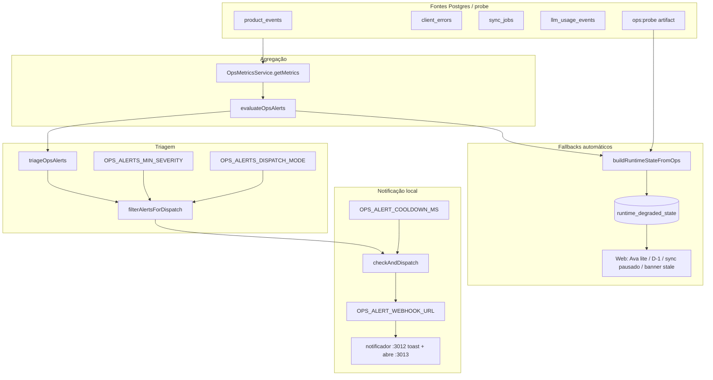
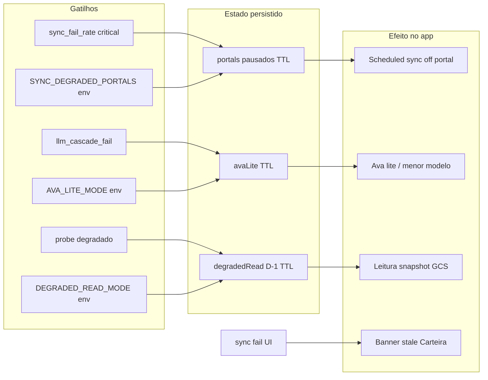
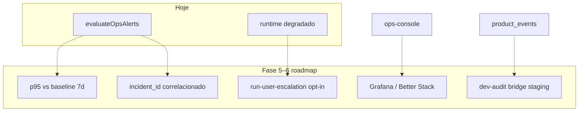

# Ops — alertas, notificações e fallbacks

> Diagramas das regras **implementadas** hoje e itens **planeados** no roadmap.  
> Código: `ops-alerts.ts`, `ops-alert-triage.ts`, `ops-alert-dispatch.service.ts`, `runtime-degraded.service.ts`.

## Fluxo principal (implementado)

**Console ops (`:3013`)** lê o mesmo snapshot via PG (não passa pelo webhook). Botão **Verificar e acionar** chama o mesmo `checkAndDispatch` que o cron.

## Thresholds de alerta (`evaluateOpsAlerts`)

| ID / família | Condição | Severidade | Pager default |
|--------------|----------|------------|---------------|
| `infra_api_down` | probe API falhou | critical | sim |
| `infra_api_slow` | API ≥ 3000 ms | warning | não |
| `infra_postgres_down` / `slow` | PG down ou ≥ 500 ms | critical / warning | critical sim |
| `infra_neo4j_down` | Neo4j down | warning | não |
| `sync_stuck_*` | job > 30 min | critical | sim |
| `sync_fail_rate_*` | fail ≥ 40%, n≥3 | warning / critical (≥70%) | critical sim |
| `llm_cascade_fail` | ≥3 fail Ava 5 min, 0 ok | critical | sim |
| `llm_quota_spike` | ≥10 quota blocked 1h | warning | não |
| `internal_llm_budget_exhausted` | orçamento interno | warning | não |

Variáveis: `OPS_PROBE_API_SLOW_MS`, `OPS_PROBE_PG_SLOW_MS`.

## Triagem e toast (`human_required`)

Modo padrão `OPS_ALERTS_DISPATCH_MODE=human_required`:

- **Critical** → `humanRequired` → webhook (se passou severidade + cooldown).
- **Warnings auto** (sem pager): `llm_quota_spike`, `internal_llm_budget_exhausted`, `infra_*_slow`, `infra_neo4j_down`, `sync_fail_rate_*` em warning.

`OPS_ALERTS_MIN_SEVERITY=critical` (padrão) filtra warnings antes do dispatch.

## Fallbacks dormentes (runtime degradado)

| Fallback | Gatilho | TTL típico | UI / API |
|----------|---------|------------|----------|
| Sync portal pausado | `sync_fail_rate_*` **critical** | `PORTAL_DEGRADED_TTL_MS` | `isPortalSyncDegraded` |
| Ava lite | `llm_cascade_fail` ou `AVA_LITE_MODE=1` | `AVA_LITE_TTL_MS` | respostas simplificadas |
| Leitura degradada D-1 | probe degradado ou `DEGRADED_READ_MODE=1` | `DEGRADED_READ_TTL_MS` | snapshot noturno GCS |
| Banner stale | falha sync / freshness | — | Carteira (web) |

**Não ativa fallback:** `sync_stuck_*` (só alerta operador), fail rate **warning** (só monitorar).

## Roadmap (planeado — tracejado)

| Item roadmap | Efeito esperado |
|--------------|-----------------|
| Baseline p95 | alerta **degradação** antes de falha total |
| `incident_id` | mesmo ID em alerta ops + `client_errors` + modo degradado |
| `run-user-escalation` | e-mail/push família (sem PHI), opt-in legal |
| `run-dev-audit-bridge` | correlacionar hooks Cursor com eventos staging |

## Testes automatizados

| Comando | O que valida |
|---------|----------------|
| `cd packages/api && npm run test:ops` | Regras alerta, triagem, pipeline, fallbacks, time series |
| `npm run ops:smoke` | API `/health`, `/ops/metrics`, `/ops/alerts` + shape |
| `OPS_SMOKE_FULL=1 npm run ops:smoke` | + console `:3013` + notificador `:3012` |
| `OPS_SMOKE_NOTIFIER_PING=1` | + POST de teste (toast real) |
| `npm run ops:notifier:simulate` | Bateria de toasts (cenários críticos produção) |
| `npm run ops:notifier:simulate -- --all` | + warnings (simulação completa) |
| `npm run setup:ops-prod` | Template .env produção (ntfy, worker, monitor) |
| Runbook | `docs/ops/RUNBOOK_ALERTS.md` |

Incluído em `test:critical`: `ops-alerts`, `ops-auth` (subset). Suite completa ops: `test:ops`.

Ver também: `docs/OBSERVABILITY.md`, `docs/OPERATION_MODEL.md`, `docs/infra/OPS_ALERT_CHANNELS.md`.
