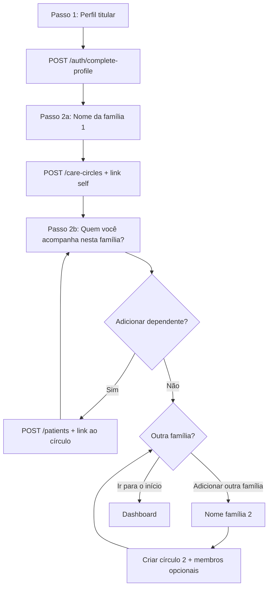

# Especificação — Nome da família e múltiplos círculos no onboarding

| Campo | Valor |
|-------|--------|
| **Versão** | 2026-10-08 |
| **Status** | **Implementado (web)** — 2026-10-08 |
| **Decisão-chave** | Onboarding **deve** suportar **várias famílias** (`care_circles`), não apenas um núcleo único |
| **Feature card** | [`auth-entry-onboarding`](./auth-entry-onboarding.md) |
| **Tier** | 2 (dados de saúde + ACL) — revisão legal recomendada no PR |

---

## 1. Objetivo

Depois do cadastro básico do **titular** (perfil `self`), o usuário:

1. **Nomeia** o primeiro círculo de cuidado (label de família / household).
2. **Adiciona perfis de saúde** (dependentes) vinculados a esse círculo.
3. Pode repetir com **«Adicionar outra família»** (novo `care_circle` + membros) antes de ir ao dashboard.
4. Só então conclui o onboarding e vê **Sua família** agrupada por círculo (comportamento já existente quando há 2+ círculos).

**Fora de escopo desta spec:** convidar outro adulto (conta Supabase) — permanece em **Família e cuidadores** (`/family`). Conectores (SUS, convênio) — épico separado.

---

## 2. Jornada do usuário (renumerar passos)

### Visão geral

| Passo global | ID técnico | Obrigatório | Conteúdo |
|--------------|------------|-------------|----------|
| **1** | `profile` | Sim | Perfil titular (≥ 18 anos, CPF, etc.) — igual ao hoje |
| **2…N** | `family_loop` | Pelo menos **1 círculo** criado (nome + vínculo do titular) | Sub-loop por família (ver §3) |
| **Fim** | `complete` | — | Dashboard + banner pós-onboarding |

O indicador de progresso deixa de ser fixo «2 de 2». Proposta:

- **Steps Ant Design (3 rótulos):** «Seu perfil» → «Suas famílias» → «Concluir»  
  - Dentro de «Suas famílias», micro-progresso: «Família 1 de N» (N = círculos já criados no wizard + o em edição).

### Fluxo feliz (uma família)



### Fluxo com duas famílias (ex.: Família A com filhos + Família B só com enteado)

1. Titular completa perfil.
2. **Família A:** nome «Família Silva» → adiciona Pedro e Lucas → **Adicionar outra família**.
3. **Família B:** nome «Família Costa» → *não* marcar «Incluir meu perfil nesta família» (default desmarcado na 2ª família) → adiciona Henrique → **Ir para o início**.
4. Dashboard mostra dois grupos; titular aparece no grupo A; Henrique no grupo B.

(Caso **Mariana** em dois círculos = fase 3 do modelo de acesso; no onboarding só se o usuário **re-vincular** um perfil já criado — ver §5.3.)

---

## 3. Sub-loop «por família»

Cada iteração do loop tem **duas telas** (podem ser sub-steps `2a` / `2b` com o mesmo `circleDraftId` em memória):

### 3.1 Tela A — Nome do círculo (`family_name`)

| Elemento | Comportamento |
|----------|----------------|
| Título | «Como você chama esta família?» |
| Subtítulo | Explicar que é um **apelido** para organizar perfis (não é nome clínico nem convênio). |
| Campo `name` | 1–120 caracteres; trim; bloqueio de nome vazio |
| Sugestão | Primeira família: placeholder **«Minha família»** ou **«Família [primeiro sobrenome do titular]»** se nome tiver ≥2 tokens |
| Famílias 2+ | Placeholder **«Outra família»**; validar **nome único** entre círculos do wizard (cliente) e API (409 se duplicar no mesmo titular — opcional futuro) |
| Primário | **Continuar** → cria círculo (API) e avança para membros |
| Secundário | Ver §4 (skip) |

### 3.2 Tela B — Membros nesta família (`family_members`)

| Elemento | Comportamento |
|----------|----------------|
| Título | «Quem você acompanha em **{nome do círculo}**?» |
| Contexto | Chip com nome da família; lista de perfis já adicionados **neste círculo** |
| Formulário | Igual ao passo 2 atual (nome, nascimento, gênero, CPF opcional, consentimento menor) |
| **Incluir você** | Checkbox só relevante na **2ª família em diante**; default **off**. Se on: `POST /care-circles/:id/patients` com `patientId` do self |
| Ações | **Adicionar pessoa** · **Adicionar outra família** (salva estado do círculo atual) · **Pular pessoas por agora** (círculo fica só com titular se 1ª família ou com vínculos já feitos) · **Ir para o início** (última CTA quando não quer mais círculos) |

**«Adicionar outra família»** sempre exige que o círculo **atual** já tenha sido persistido (nome salvo). Volta à tela A com índice N+1.

---

## 4. Regras de pular e defaults (por círculo)

| Círculo | Nome | Membros | Efeito no dashboard |
|---------|------|---------|---------------------|
| **1º** (obrigatório existir) | Se usuário tocar **«Usar sugestão»** ou confirmar placeholder | Pode **pular pessoas** | 1 círculo com nome default **«Minha família»** + `self` vinculado |
| **1º** | **Não** permitir sair do onboarding **sem** criar o 1º círculo (sem atalho «pular tudo» que deixe zero círculos) | — | Evita conta sem agrupamento (hoje o backfill 059 não roda no `complete-profile`) |
| **2º+** | Default **«Família 2»**, **«Família 3»**… se usuário não editar (botão sugerir) | Opcional vazio | Círculo existe; pode ter 0 perfis além do titular se checkbox «Incluir você» |
| **2º+** | Usuário pode **desistir** do círculo em rascunho com **«Cancelar esta família»** antes do POST create | — | Volta à tela B da família anterior ou conclui |
| **Qualquer** | **Ir para o início** | — | Equivalente ao «Pular dependentes» global de hoje, mas **após** ≥1 círculo nomeado |

**Paridade com hoje:** usuário que só quer titular → nome default família 1 + **Pular pessoas** + **Ir para o início** (2 telas a mais que o fluxo atual de 2 passos).

---

## 5. Mapeamento técnico

### 5.1 Modelo de dados ([`FAMILY_ACCESS_MODEL.md`](../FAMILY_ACCESS_MODEL.md), migration **059**)

| Conceito | Tabela / API |
|----------|----------------|
| Família / círculo | `care_circles` (`name`, `billing_owner_account_id`) |
| Titular da conta no círculo | `care_circle_members` (`role = owner`) — criado no `POST /care-circles` |
| Perfil no círculo | `patient_circle_links` via `POST /care-circles/:id/patients` |
| Perfil de saúde | `patients` + `patient_memberships` (`guardian` / `self`) — inalterado |

### 5.2 Endpoints existentes (suficientes para MVP)

| Ordem | Método | Uso no onboarding |
|-------|--------|-------------------|
| 1 | `POST /auth/complete-profile` | Passo 1 — cria `self` |
| 2 | `POST /care-circles` `{ name }` | Cada nova família no loop |
| 3 | `POST /care-circles/:id/patients` `{ patientId }` | Vincular `self` (1ª família automático; 2ª+ se checkbox) |
| 4 | `POST /patients` | Cada dependente |
| 5 | `POST /care-circles/:id/patients` | Vincular dependente ao círculo **ativo** |
| — | `GET /care-circles` | Reconciliar se usuário recarregar página (retomar wizard) |
| — | `GET /care-circles/:id/linkable-patients` | Re-vincular perfil já criado em outro passo do loop (opcional UI) |
| — | `PATCH /care-circles/:id` | Renomear antes de sair do sub-step nome (se create adiado — não recomendado) |

**Settings / Família:** após onboarding, gestão contínua em `/family` (`FamilyHubContent`, `CareCirclesPanel`) — mesmas rotas.

### 5.3 Lacunas recomendadas (implementação)

| Lacuna | Risco | Proposta |
|--------|-------|----------|
| Nenhum círculo criado no `complete-profile` | Dashboard sem grupo até backfill manual | Wizard **sempre** chama `POST /care-circles` na família 1 |
| Várias chamadas sem transação | Círculo órfão ou paciente sem link | Idempotency-key opcional ou endpoint composto `POST /auth/onboarding/family-batch` (tier 2) |
| Wizard session | Recarga perde sub-step | Estender `onboarding-wizard-storage.ts`: `step`, `circleIndex`, `activeCircleId`, `phase: name \| members` |

### 5.4 ACL e billing

- `billing_owner_account_id` = conta logada (titular onboarding).
- Convites e co-admins: **fora** do wizard; link «Convidar depois em Família e cuidadores».
- Limite de pacientes do plano: validar no `POST /patients` como hoje.

---

## 6. Wireframe (ASCII)

```
┌─────────────────────────────────────────────┐
│  [logo]  Organize o cuidado da sua família   │
│  ● Seu perfil  ○ Suas famílias  ○ Concluir   │
├─────────────────────────────────────────────┤
│  Família 1 de 1                              │
│                                              │
│  Como você chama esta família?               │
│  É só um nome para agrupar perfis no app.    │
│                                              │
│  ┌─────────────────────────────────────┐    │
│  │ Família Silva                        │    │
│  └─────────────────────────────────────┘    │
│  Sugestão: Minha família                     │
│                                              │
│  [ Continuar ]                               │
└─────────────────────────────────────────────┘

┌─────────────────────────────────────────────┐
│  Quem você acompanha em Família Silva?       │
│  ┌─ Você (Maria) — já nesta família ─────┐  │
│  │  (auto na 1ª família)                   │  │
│  └────────────────────────────────────────┘  │
│  + Form dependente (como hoje)               │
│  [ Adicionar pessoa ]                        │
│  ─────────────────────────────────────────  │
│  [ + Adicionar outra família ]               │
│  [ Pular pessoas por agora ]  [ Ir para o início ] │
└─────────────────────────────────────────────┘
```

---

## 7. i18n — tom «família»

| Evitar | Preferir (pt-BR) |
|--------|------------------|
| Paciente, núcleo familiar clínico | **Perfil de saúde**, **pessoa que você acompanha** |
| Household (inglês na UI) | **Família** / **círculo de cuidado** (tooltip curto) |
| Care circle (cru) | **Família** na UI; «círculo» só em glossário `/family` |

Chaves novas sugeridas (prefixo `onboarding.`):

- `familiesTitle`, `familyNameLabel`, `familyNameHint`, `familyMembersTitle`, `familyMembersInCircle`
- `addAnotherFamily`, `skipMembersForCircle`, `includeSelfInCircle`, `familyIndexProgress`
- `familyNameDefault`, `familyNameDefaultNumbered` («Família {{n}}»)

Manter `onboarding.dependents*` como alias deprecated até migrar copy.

---

## 8. Telemetria (`onboarding_step`)

| `step` (novo) | Quando |
|---------------|--------|
| `step_3_family_name_viewed` | Tela nome (índice do círculo em `circle_index`) |
| `family_circle_created` | `POST /care-circles` OK |
| `family_member_added` | Dependente criado + link no círculo |
| `family_members_skipped` | Pular pessoas no círculo atual |
| `another_family_started` | Tap «Adicionar outra família» |
| `onboarding_families_complete` | Ir para o início |

Manter eventos legados (`step_2_viewed`, `dependent_added`, …) com mapeamento documentado na implementação para não quebrar dashboards.

---

## 9. QA — impacto

| Suite | Mudança esperada após implementação |
|-------|-------------------------------------|
| [`auth-entry-flow`](../testing/suites/auth-entry-flow.md) | Cenário C: após perfil → tela **nome família** → membros → dashboard; opcional cenário D: duas famílias |
| [`onboarding-flow`](../testing/suites/onboarding-flow.md) | Renumerar passos; `data-testid` novos: `onboarding-step-family-name`, `onboarding-step-family-members`, `onboarding-add-another-family` |
| `family-access-matrix` | Sem mudança obrigatória; opcional smoke «círculo criado no onboarding aparece em `/family`» |

**Até implementar:** suites atuais permanecem válidas (2 passos). Marcar cenários novos como **planned** nas specs de teste.

Comandos (pós-ship):

```bash
npm run qa:reset-onboarding-user
npm run qa:run -- --suite auth-entry-flow
npm run qa:run -- --suite onboarding-flow
```

---

## 10. Mobile (Expo)

Paridade 80/20: mesmo loop após aprovação web; reutilizar `packages/mobile/app/(app)/onboarding.tsx` com storage compartilhado conceitual. **Não** bloquear ship web.

---

## 11. Critérios de aceite

- [x] Novo usuário signup nunca fica com zero `care_circles` ao concluir onboarding.
- [x] Pode criar ≥2 círculos com nomes distintos e dependentes diferentes em cada um.
- [x] Titular (`self`) vinculado ao 1º círculo automaticamente; 2º círculo só inclui titular se checkbox marcado.
- [x] Dashboard agrupa por família sem passo extra em `/family`.
- [x] Recarga em `/onboarding` retoma passo correto (sessionStorage + círculos já criados via GET).
- [x] Suites `auth-entry-flow` e `onboarding-flow` atualizadas (E2E cenário C; multi-família D manual).

---

## 12. Referências

- [`docs/features/family-access-model.md`](./family-access-model.md)
- [`docs/FAMILY_ACCESS_MODEL.md`](../FAMILY_ACCESS_MODEL.md)
- [`database/relational/059_care_circles.sql`](../../database/relational/059_care_circles.sql)
