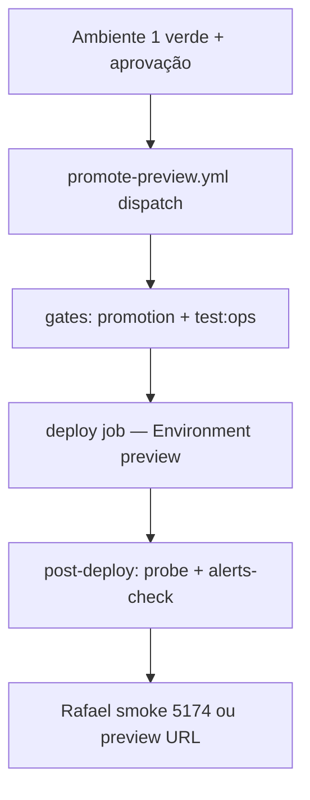

# Deploy Preview — Ambiente 2 (GCP)

> **Última atualização:** 2026-09-03  
> **Hoje:** Preview **local** (`npm run up:preview`).  
> **Alvo:** GCP após ritmo de trabalho funcional com promoção local estável.

## Estado atual

| Item | Status |
|------|--------|
| Promoção local | `npm run up:preview` + `npm run preview:validate` |
| Hostnames locais | `staging.aiyracare.test` — [`LOCAL_HOSTNAMES.md`](./LOCAL_HOSTNAMES.md) |
| Gates CI | `promote-preview.yml` → `run-promotion-gates.mjs` |
| Runbook GCP | [`GCP_PREVIEW_RUNBOOK.md`](./GCP_PREVIEW_RUNBOOK.md) |
| Deploy GCP | `promote-preview.yml` — inputs `deploy_gcp`, `deploy_worker` — [`GCP_PREVIEW_RUNBOOK.md`](./GCP_PREVIEW_RUNBOOK.md) |
| Código deploy | `npm run deploy:preview:gcp` · `npm run deploy:preview:worker` |

## Workflow



## Configurar Preview no GCP (quando migrar)

**Runbook completo:** [`GCP_PREVIEW_RUNBOOK.md`](./GCP_PREVIEW_RUNBOOK.md)

1. Cloud SQL PostgreSQL **dedicado** (sintético — não compartilhar com integração local).
2. Compute: Cloud Run (API + web) ou GCE — alinhar ao que prod usará.
3. GitHub Environment `preview` — [`GITHUB_ENVIRONMENTS_SECRETS.md`](./GITHUB_ENVIRONMENTS_SECRETS.md).
4. Substituir deploy placeholder em `.github/workflows/promote-preview.yml`.
5. `connect-worker` no GCP ou job agendado; `CONNECT_WORKER_EXTERNAL=1` na API preview.
6. Billing/uptime: projeto `openhealth-503119` — [`GCP_BILLING_ALERTS.md`](./GCP_BILLING_ALERTS.md).

## Configurar host preview (alternativas — não prioritário)

Fly/Railway/VM genérica se GCP não for o caminho. Preferência atual: **GCP** (seção acima).

1. Node 22 + PostgreSQL dedicado (sintético).
2. GitHub Environment `preview` — [`GITHUB_ENVIRONMENTS_SECRETS.md`](./GITHUB_ENVIRONMENTS_SECRETS.md).
3. Deploy real em `promote-preview.yml`.
4. API + web + connect-worker + ops-console.
5. `npm run setup:ops-preview` no host.

## Post-deploy (obrigatório)

```powershell
# Local preview (3020)
npm run preview:post-deploy

# Host GCP — seed só na primeira vez ou refresh semanal
npm run preview:post-deploy

# Após deploy que já aplicou migrations e não deve resetar dados
$env:SKIP_SEED = '1'
npm run preview:post-deploy
```

Equivalente manual:

```powershell
npm run seed:staging-refresh      # opcional
cd packages/api && npm run staging:probe-gate
npm run ops:alerts-check
```

## CI post-deploy job

`promote-preview.yml` inclui job `post-deploy` que roda `preview-post-deploy.mjs` com secrets do Environment `preview`. Falha se probe ou alerts-check falham — bloqueia promoção silenciosa com stack degradada.

## Worker no preview

```powershell
$env:CONNECT_WORKER_EXTERNAL = '1'
$env:OPS_ALERTS_INTERVAL_MS = '900000'
npm run connect-worker
```

Sem worker + `OPS_WORKER_MONITOR=1` → alerta `worker_stale` (esperado).

## Relação com staging.yml

`staging.yml` / Environment `staging` = esteira `main` legada. Preview (Ambiente 2) usa Environment `preview` e promoção explícita. Podem coexistir até consolidar naming.

## Go-live produção

Preview **não** promove automaticamente a prod. Gates: CNPJ, Stripe live, `human-review-gates`, `deploy-prod.yml`.
