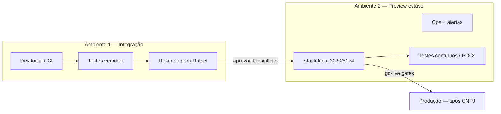

# Modelo de dois ambientes não produtivos

> **Última atualização:** 2026-09-02  
> Preparação go-live: separar **desenvolvimento + validação agente** do **preview estável** para você testar.

## Política de hosting (decisão Rafael)

| Ambiente | Agora | Depois |
|----------|-------|--------|
| **1 — Integração** | **Local** (`up.ps1`, PG `aiyracare`, `3010/5173`) + CI GitHub | Continua local (+ CI); sem cloud dedicada planejada |
| **2 — Preview estável** | **Local** (`up:preview`, PG `aiyracare_preview`, `3020/5174`) | **GCP** após ritmo de trabalho funcional (promoção + testes + ops) |
| **Produção** | — | GCP (ou alinhado ao stack prod), após CNPJ |

**Fora de escopo por hora:** Cursor Cloud, Fly/Railway como Preview — outro debate.

## Fase atual: ambos locais

Os dois ambientes na **mesma máquina**, com **PG e portas distintas**. CI valida Ambiente 1 em cada PR. Promoção Preview = `npm run up:preview` após aprovação.

| | Integração (1) | Preview (2) |
|---|----------------|-------------|
| **Subir** | `scripts/up.ps1` ou `npm run stack:start` | `npm run up:preview` |
| **API** | `http://127.0.0.1:3010` | `http://127.0.0.1:3020` |
| **Web** | `http://localhost:5173` | `http://localhost:5174` |
| **PG** | `aiyracare` | `aiyracare_preview` |
| **Ops console** | `:3013` | `:3023` |

Podem rodar **em paralelo** — agente no 3010, você testando no 5174.

## Visão

| | **Ambiente 1 — Integração** | **Ambiente 2 — Preview estável** |
|---|---------------------------|----------------------------------|
| **Quem usa** | Agentes, dev (Cursor), CI | Rafael — testes manuais, POCs, demos |
| **Estabilidade** | Volátil — pode quebrar durante task | Estável — só entra código **promovido** |
| **Dados** | PG `aiyracare` + massas demo; scrapers reais opcionais | PG `aiyracare_preview` sintético (`seed:staging-refresh`) |
| **Objetivo** | Implementar + validar verticais antes de te pedir aprovação | Você não deveria encontrar bugs técnicos (ou mínimo) |
| **Hosting** | **Local** (+ CI) | **Local** → **GCP** (após ritmo funcional) |

Detalhe operacional: [ENV_INTEGRATION.md](./ENV_INTEGRATION.md) · [ENV_PREVIEW.md](./ENV_PREVIEW.md).

---

## Promoção Ambiente 1 → 2 (local)

1. Agente implementa na branch / local (3010/5173).
2. Roda **gates verticais** — ver [`TESTING_VERTICALS.md`](../TESTING_VERTICALS.md).
3. Gera **relatório** — `npm run promotion:gates` → `promotion-report-last.md`.
4. Rafael recebe: ✅ passou · ❌ falhou · ⚠️ decisão necessária.
5. **Aprovação explícita** (chat/issue).
6. Rafael (ou agente após aprovação): `npm run up:preview` — refresh PG preview + stack 3020/5174.
7. `staging:probe-gate` apontando API preview (`API_PUBLIC_URL=http://127.0.0.1:3020`).

Workflow `.github/workflows/promote-preview.yml` — ativar quando Preview estiver no **GCP** (projeto `openhealth-503119` ou dedicado). Hoje: promoção local.

## Evolução Preview → GCP

Critério para migrar (não automatizado — decisão conjunta):

1. Ritmo estável: `promotion:gates` → aprovação → `up:preview` → smoke sem regressões técnicas recorrentes.
2. Ops local nos dois PGs sem pager falso (`worker_stale`, keys distintas).
3. Documentar runbook GCP Preview em [`DEPLOY_PREVIEW.md`](./DEPLOY_PREVIEW.md) (Cloud Run / GCE + Cloud SQL sintético).

Integração (Ambiente 1) **permanece local** — scrapers, CDP Chrome e portais convênio continuam na sua máquina.

---

## Ops nos dois ambientes (local)

Mesma **topologia** (API + web + worker + PG + ops-console), **instâncias separadas**:

| Capacidade | Ambiente 1 | Ambiente 2 local |
|------------|------------|------------------|
| `GET /health`, `/health/db` | `:3010` | `:3020` |
| Ops console | `:3013` → PG `aiyracare` | `:3023` → PG `aiyracare_preview` |
| `staging:probe-gate` | API integração | API preview |
| Connect worker | Opcional | Recomendado ao testar sync agendado |
| Alertas | `setup:ops-alerts` | `setup:ops-preview` (opcional local) |

Ver [`OBSERVABILITY.md`](../OBSERVABILITY.md) e [`OPS_TWO_ENV_SETUP.md`](./OPS_TWO_ENV_SETUP.md).

---

## Produção (terceira camada — fora deste doc)

Só após CNPJ + `human-review-gates` fiscal. Não promover preview → prod sem checklist em `deploy-prod.yml`.

---

## Mapa com docs antigos

| Conceito antigo | Novo nome |
|-----------------|-----------|
| Local máquina dev | **Ambiente 1** (`aiyracare`, 3010/5173) |
| `staging` sintético | **Ambiente 2** (`aiyracare_preview`, 3020/5174) |
| `ENVIRONMENTS.md` matriz 3-tier | Complementa; este doc é o **processo** |
