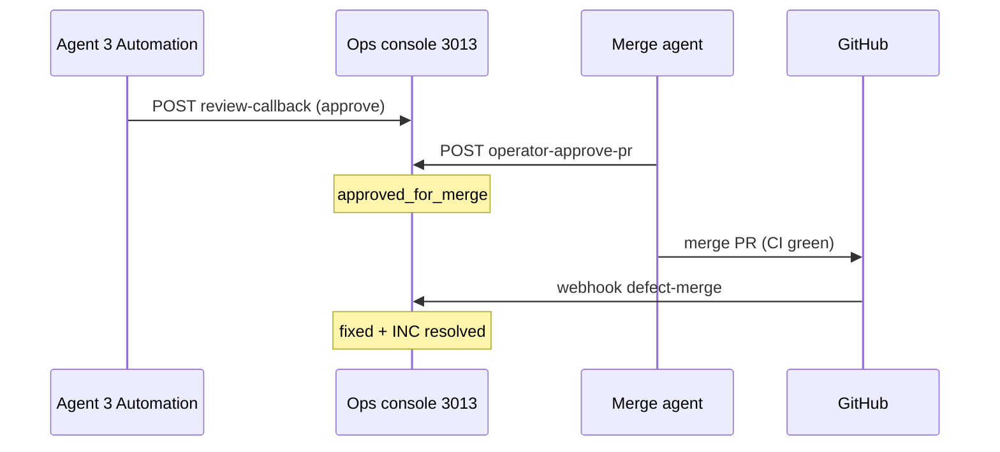

# CH — G3 agêntico (`operator-approve-pr`)

**Status:** spec autorizada (2026-10-06)  
**Épico:** `ch-cycle-close` · fatia **C5** · complementa [`CH_PR_REVIEW_AGENT.md`](./CH_PR_REVIEW_AGENT.md)  
**Carta:** [`OPS_SOLO_OPERATOR_CHARTER.md`](../OPS_SOLO_OPERATOR_CHARTER.md) §4 — **sem clique humano** no CH para «Aprovar para merge»

**Relacionado:** [`CH_CYCLE_CLOSE_SPEC.md`](./CH_CYCLE_CLOSE_SPEC.md) §5 · [`CH_AUTONOMOUS_OPS_STACK.md`](./CH_AUTONOMOUS_OPS_STACK.md) · túnel/callback [`CH_OPS_CALLBACK_TUNNEL_SPEC.md`](./CH_OPS_CALLBACK_TUNNEL_SPEC.md)

---

## 1. Objetivo

Registrar no CH a **intenção G3** («aprovado para merge») via `POST /api/platform-defects/:id/operator-approve-pr` executado por **agente ou automation**, espelhando o que a UI CH faria — **sem** depender de Rafael e **sem** merge GitHub nesta rota.

| Etapa | Responsável agêntico | Rota / ferramenta |
|-------|----------------------|-------------------|
| Review advisory (R3) | Cursor Automation Agent 3 | `review-callback` |
| **G3 approve (esta spec)** | Agente pós-review ou automation dedicada | `operator-approve-pr` |
| Merge `main` | Agente (ManagePullRequest / `gh` quando charter) | GitHub — **fora** desta rota |

A mensagem ops-console atual («conclua o merge manualmente no GitHub») é legado de copy **pré-charter**; runbooks novos devem apontar merge agêntico após `pipeline_status = approved_for_merge` + CI verde.

---

## 2. Pré-condições (hard)

| Campo | Valor |
|-------|--------|
| `platform_defects.status` | `ready_for_pr` |
| `pr_url` | URL GitHub válida (registrar via C7 `register-pr` se ausente) |
| Defeito | Escopo CH (`platform_defects`); não aplica a PRs órfãos |

**Não validado por `operator-approve-pr` (v1):**

- `CH_PR_REVIEW_REQUIRE_CI_GREEN` — aplica só em `request-review` (412 `ci_not_green`). G3 agêntico deve **esperar** `pipeline_status = ci_success` por política do agente de merge, não por esta rota.
- Branch protection GitHub — inalterada.

---

## 3. Contrato HTTP

**Rota:** `POST /api/platform-defects/:id/operator-approve-pr` (ops-console `:3013`)

**Body (JSON):**

```json
{
  "note": "opcional — contexto do agente (run id, suite qa)",
  "override": false,
  "overrideReason": "obrigatório se override=true e gate G3 ativo"
}
```

**Sucesso (200):**

```json
{
  "ok": true,
  "prUrl": "https://github.com/RafaDru/aiyra-care/pull/N",
  "item": { "...": "PlatformDefectWithLatestReview" },
  "message": "..."
}
```

**Erros:**

| HTTP | `error` | Quando |
|------|---------|--------|
| 404 | `not_found` | UUID inválido |
| 409 | `invalid_state` | Status ≠ `ready_for_pr` |
| 409 | `review_missing` | `CH_G3_REQUIRE_REVIEW_APPROVE=1`, sem review `completed`, `override` ≠ true |
| 409 | `review_approval_required` | Gate on, última review `recommendation` ≠ `approve`, sem override |
| 400 | `invalid_payload` | `override=true` sem `overrideReason` não vazio |

Implementação: `PlatformDefectPrReviewService.operatorApprovePr` · vitest `platform-defect-pr-review.test.ts`.

---

## 4. Caminho **approve** vs **override**

Controlado por `CH_G3_REQUIRE_REVIEW_APPROVE` (`defect-ci-pipeline.config.ts`).

| Env | Comportamento |
|-----|----------------|
| `0` / omitido (**notebook default**) | `operator-approve-pr` sempre persiste G3 se `ready_for_pr` — review agêntico **recomendado** mas não bloqueante |
| `1` (**produção solo recomendada**) | Exige última review `completed` com `recommendation === 'approve'` **ou** override auditável |

### 4.1 Approve normal (sem override)

1. Agent 3 conclui `POST …/review-callback` com `recommendation: "approve"`.
2. Agente de fechamento (cloud worker, Project agent, ou passo final da automation review) chama `operator-approve-pr` com `note` opcional (ex. `agentRunUrl`, suite QA).
3. PG: `operator_pr_approved_at`, `pipeline_status = approved_for_merge`.

### 4.2 Override (gate `CH_G3_REQUIRE_REVIEW_APPROVE=1`)

Usar quando review ausente, `failed`, `request_changes`, ou `block`, mas política explícita autoriza merge (ex. hotfix estratégico decidido em §2 charter — **decisão humana**, execução ainda agêntica).

```json
{
  "override": true,
  "overrideReason": "charter: hotfix P0 sync — review block ignorado com decisão 2026-10-06",
  "note": "bc-… agent run"
}
```

A nota persistida concatena `[override] {overrideReason}` + `note` em `operator_pr_approved_note` (máx. 4000 chars).

**Proibido:** override silencioso (`override` sem reason) — HTTP 400.

---

## 5. `CH_PR_REVIEW_REQUIRE_CI_GREEN` (opcional, R2)

| Valor | Efeito |
|-------|--------|
| `0` (default) | `request-review` dispara com CI pendente; agente reflete em `ciSnapshot` |
| `1` | `request-review` → **412** `ci_not_green` se `pipeline_status !== ci_success` |

**Política G3 agêntico recomendada (solo operator):**

```text
request-review  → CH_PR_REVIEW_REQUIRE_CI_GREEN=1 quando webhook defect-ci ou poll ativo (#114)
operator-approve-pr → agente só chama após ci_success + recommendation=approve (ou override documentado)
merge GitHub      → CI verde + test:critical / qa:run conforme DELIVERY_PIPELINE
```

Não misturar «CI opcional no review» com «merge sem CI» — o gate de merge fica no agente de entrega, não na rota G3.

---

## 6. Quem chama (automation vs agente)

| Caller | Quando | Como alcançar `:3013` |
|--------|--------|------------------------|
| **Cursor Automation** (passo pós `review-callback`) | `recommendation=approve` e política CI OK | `callbackUrl` base = `OPS_CONSOLE_PUBLIC_URL` — ver [`CH_OPS_CALLBACK_TUNNEL_SPEC.md`](./CH_OPS_CALLBACK_TUNNEL_SPEC.md) |
| **Cloud / Project agent** | Após suite QA + review card verde | `curl` via túnel ou worker no notebook com localhost |
| **Notebook worker** | Ciclo completo sem nuvem | `http://127.0.0.1:3013` — automações Cursor **nuvem** ainda precisam túnel |

**Auth v1:** rotas mutadoras do ops-console no notebook assumem rede local / VPN; callbacks usam `OPS_INVESTIGATOR_CALLBACK_KEY`. **Spec futura (P1 código):** mesmo header em `operator-approve-pr` para chamadas via túnel público — até lá, restringir túnel a IP allowlist Cloudflare.

**Não é G3:** `operator-request-changes` — reabre DEF (`open`); usar quando review `request_changes` / CI fail pós-merge.

---

## 7. Campos de auditoria (PG + timeline)

| Campo / artefato | Conteúdo |
|------------------|----------|
| `platform_defects.operator_pr_approved_at` | Timestamp G3 |
| `platform_defects.operator_pr_approved_note` | `note` + prefixo `[override] …` |
| `platform_defects.pipeline_status` | `approved_for_merge` até webhook merge |
| `defect_pr_reviews` (última `completed`) | `dimensions`, `recommendation`, `agent_run_url`, `head_sha` |
| UI CH (#114) | Checkbox override + reason espelha body API |
| `product_events` / dev-audit | Opcional: agente loga `ch_g3_agentic_approve` com `defectId`, `override` |

Timeline C6: nó entre `review_completed` e merge — label «G3 aprovado (agente)».

---

## 8. Fluxo de referência (mermaid)



---

## 9. Critérios de aceite (spec)

1. Documentação alinhada à charter: G3 **não** listado como tarefa humana.
2. Tabela approve vs override reproduz comportamento vitest existente.
3. `CH_PR_REVIEW_REQUIRE_CI_GREEN` documentado só em `request-review`, com política de merge separada.
4. Link neste arquivo a partir de [`CH_OPS_GAP_AND_PRIORITY.md`](./CH_OPS_GAP_AND_PRIORITY.md) e hub stack.
5. **Implementação P1 (opcional):** automation template `g3-approve-after-review` + auth header; suite `ops-ch-cycle-close` passo «G3 via API sem UI».

---

## 10. Env (resumo)

| Variável | Default notebook | Produção solo (recomendado) |
|----------|------------------|-----------------------------|
| `CH_G3_REQUIRE_REVIEW_APPROVE` | `0` | `1` |
| `CH_PR_REVIEW_REQUIRE_CI_GREEN` | `0` até CI estável | `1` com defect-ci webhook |
| `CH_AUTO_PR_REVIEW_ON_READY` | on | on |
| `OPS_CONSOLE_PUBLIC_URL` | túnel se automação nuvem | URL estável preview/GCP |
