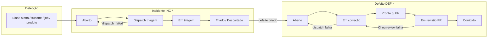

# Command Hub — Jornada operador solo (especificação / plano)

> **Modo:** plano de produto + roadmap de implementação  
> **Data:** 2026-10-01  
> **Contexto:** Rafael opera solo; **aprovação humana** é a esteira final após tudo que for plausível automatizar. Revisão de PR **agêntica sob demanda**, sempre com **aprovação explícita** antes de merge.

**Relacionado:** [`CH_INCIDENT_DEFECT_PIPELINE.md`](./CH_INCIDENT_DEFECT_PIPELINE.md) · [`CH_DEFECT_PIPELINE_DECISIONS.md`](./CH_DEFECT_PIPELINE_DECISIONS.md) · [`SOLO_OPERATOR_RUNBOOK.md`](./SOLO_OPERATOR_RUNBOOK.md) · [`CORRECAO_DEV_E2E_CHECKLIST.md`](./CORRECAO_DEV_E2E_CHECKLIST.md) · [`DEFEITO_EM_CORRECAO.md`](./DEFEITO_EM_CORRECAO.md) · piloto **DEF-000001** (E2E Correção PASS 2026-10-01)

---

## 1. Objetivo

Descrever a jornada **ponta a ponta** — da detecção do problema até **Corrigido** com merge aprovado — incluindo:

1. O que roda **sem** Rafael vs o que exige **gate humano**.
2. **Caminho de falha** em cada etapa: sinal no CH, ação de recuperação, e quando **voltar para correção** com contexto estruturado (não “reset silencioso”).
3. Fase **revisão de PR**: automação **opcional** (agente de review), decisão **sempre** do operador.

---

## 2. Princípios (operador solo)

| # | Princípio |
|---|-----------|
| P1 | **Automação até o limite seguro**; Rafael não re-dispara etapas que o sistema pode repetir sozinho (outbox, retry-dispatch, reenfileirar correção). |
| P2 | **Um lugar para olhar:** CH Operação → Incidentes / Defeitos; refs humanas `INC-*` / `DEF-*`. |
| P3 | **Falha visível:** nenhum estado “mentiroso” (`in_fix` sem dispatch, `ready_for_pr` sem evidência mínima). |
| P4 | **Esteira que falhou → volta para correção** com `failureReason` + link CI/logs (não só toast genérico). |
| P5 | **Merge em `main` só após aprovação de Rafael**; agente de review **recomenda**, nunca mergeia. |
| P6 | **Tier 0 default** no piloto; Tier 1 (PR draft + allowlist) quando `OPS_INVESTIGATOR_TIER1=1`. |

---

## 3. Mapa da jornada (macro)

**Gates humanos (Rafael):**

| Gate | Quando | Ação típica |
|------|--------|-------------|
| **G0** | Opcional | Priorizar / descartar incidente na fila |
| **G1** | Triagem ambígua | Completar/descartar análise manual (já existe em suporte legado) |
| **G2** | Antes de gastar correção | **Iniciar correção** (`start-fix`); revalidar se voltou de falha |
| **G3** | `ready_for_pr` | Solicitar **review agêntico** (sob demanda) + **aprovar merge** |
| **G4** | Pós-merge | **Corrigido** no CH (+ deploy verificado se aplicável) |

---

## 4. Etapas, automação e falhas

### 4.1 Detecção → incidente (`INC-*`)

| | |
|--|--|
| **Entrada** | `support_report`, `ops_alert`, ingest manual, telemetria (`product_events`, `client_errors`), sync degradado, etc. |
| **Automático** | Insert `ops_analysis_queue`, `reference_code` INC, outbox triagem (worker/reconciliador), webhook Triador Dev/SRE |
| **Humano** | G0/G1 se necessário |

**Falhas e recuperação**

| Sintoma CH / PG | Causa provável | Recuperação | Volta para correção? |
|-----------------|----------------|-------------|----------------------|
| **Falha** (`dispatch_failed`) | Webhook off, 4xx/5xx, outbox `dead` | Corrigir `CURSOR_*` + **Nova tentativa** / `retry-dispatch` / `reset-dead` | N/A (ainda não há defeito) |
| **Aberto** > SLA sem outbox (D5) | Legado / reconciliação | `ch-incident-dispatch-backfill` | N/A |
| Callback triagem falha (D11) | Auth, URL, payload | `analysisLastError` no detalhe; re-disparar triagem | N/A |
| **Descartado** | Triagem concluiu sem defeito | Encerrar | — |
| **Triado** | Callback OK + defeito | Segue §4.2 | — |

**Estado hoje:** F1–F3 entregues (Falha, Dispatch no detalhe, health banner). **Gap (R0):** playbook único — [`SOLO_OPERATOR_RUNBOOK.md`](./SOLO_OPERATOR_RUNBOOK.md).

---

### 4.2 Triagem → defeito (`DEF-*`)

| | |
|--|--|
| **Automático** | Callback triagem cria/vincula `platform_defects`, dedup `fingerprint`, `DEF-*` |
| **Humano** | Revisar resumo no CH; decidir **Iniciar correção** (G2) |

**Falhas**

| Sintoma | Recuperação |
|---------|-------------|
| Defeito duplicado / título errado | Edição manual limitada hoje; futuro: merge defeitos |
| Incidente triado sem defeito (bug callback) | Re-triagem manual; auditar callback |

---

### 4.3 Correção (`open` → `in_fix` → `ready_for_pr`)

| | |
|--|--|
| **Automático** | `start-fix` só com `dispatch.outcome === sent`; Automation **Correção Dev**; callback `ready_for_pr` |
| **Humano** | G2: **Iniciar / Reenfileirar correção**; não “autorizar análise” de novo após `ready_for_pr` |

**Falhas e recuperação**

| Sintoma | Causa | Recuperação | Volta para correção |
|---------|-------|-------------|---------------------|
| Permanece `open` após start-fix | `dispatch` skipped/failed | Health `defectFix`; reenviar com body JSON `{}` | Repetir G2 |
| `in_fix` indevido | Sem `last_fix_dispatch_sent_at` | Reconciliação → `open` (077) | G2 de novo |
| Automation não roda | Disabled, URL errada | Habilitar automation; corrigir env | G2 |
| Callback 401/409 | Auth / transição | Ajustar `OPS_INVESTIGATOR_CALLBACK_KEY` | Agente reexecuta ou manual `Marcar pronto p/ PR` (escape hatch) |
| Agente bloqueado | Escopo ambíguo | `remediationSummary` com bloqueio; operador decide | PATCH `open` + novo ciclo G2 |

**Estado hoje:** E2E piloto PASS. **Gap:** não há estado **`correction_failed`** nem reabertura automática quando callback declara falha explícita (R1).

---

### 4.4 Revisão de PR e esteira CI (`ready_for_pr` → merge → `fixed`)

| | |
|--|--|
| **Automático (desejado)** | Push branch → abrir PR → **CI GitHub** (api, migrations, web, agents); opcional lote `defect_pr_batches` |
| **Automático (novo — plano)** | Agente **PR Review sob demanda** após CI verde (ou em paralelo com ressalva) |
| **Humano (G3)** | Aprovar merge; rejeitar → volta correção com detalhes |

**Fluxo alvo (operador solo)**

1. Defeito **Pronto p/ PR** — branch/PR no detalhe (`branchName`, `prUrl` quando Tier 1).
2. Rafael clica **「Solicitar revisão agêntica」** (novo) → dispara webhook/automation dedicada com `defectId`, `prUrl`, diff scope.
3. Agente review posta comentário estruturado no PR + callback ops com `{ recommendation: approve | request_changes, findings[], ciStatus }`.
4. **Se CI falhou:** defeito → `in_fix` (ou novo status `awaiting_fix`) com `lastPipelineFailure` (URL run, jobs falhos, logs resumidos); CH mostra **「Voltar à correção」** pré-preenchido para re-dispatch.
5. **Se review pede mudanças:** mesmo retorno à correção com `reviewFeedback` no payload do próximo `start-fix`.
6. Rafael **Aprovar merge** (GitHub) → CH **Corrigido** (`fixed`) + opcional `mergedPrUrl`.

**Estado hoje**

| Capacidade | Status |
|------------|--------|
| `ready_for_pr` + refs DEF | Entregue (#83) |
| Lote PR (agrupa só) | Entregue (073); **não** abre PR nem roda CI |
| CI obrigatório antes de `ready_for_pr` | **Não** (agente declara testes) |
| Review agêntico | **Não** (só manual + Cursor ad hoc) |
| Falha CI → estado defeito + re-dispatch | **Não** |

---

## 5. Modelo de estados proposto (extensão)

Manter estados atuais; adicionar **sub-estados ou colunas** para falha de esteira pós-`ready_for_pr`:

| Campo / status | Uso |
|----------------|-----|
| `pipeline_status` | `null` \| `ci_running` \| `ci_failed` \| `review_pending` \| `review_failed` \| `approved_for_merge` |
| `last_failure_kind` | `dispatch` \| `callback` \| `ci` \| `review` \| `human_reject` |
| `last_failure_summary` | Texto curto + JSON link (Actions run, review thread) |
| `pr_url` | Canônico quando PR existe |

**Transição desejada:** `ci_failed` \| `review_failed` → **`in_fix`** (limpa `ready_for_pr_at`? ou mantém histórico) + preserva `remediationSummary` anterior + anexa `fixContext` para o próximo webhook Correção Dev.

> Decisão de design (implementação): preferir **não** inventar status PG novo se `in_fix` + colunas de falha bastarem para UI.

---

## 6. Automações (lanes)

| Lane | Automation | Disparo | Callback |
|------|------------|---------|----------|
| Triagem Dev | Aiyra - Triador Dev | Outbox `triage_v1` | `analysis-queue/callback` → triaged + defeito |
| Triagem SRE | Aiyra - Triador SRE | idem ops_alert | idem |
| Correção | Aiyra - Correção Dev | `start-fix` / `defect_fix_v1` | `defectStatus: ready_for_pr` |
| **Review PR (novo)** | Aiyra - Revisão PR (nome TBD) | **Manual** no CH (G3) | `reviewOutcome` + comentário PR |

Instruções do review agent (rascunho de requisito):

- Ler PR diff + CI checks via API GitHub (token ops).
- Não mergear; não push.
- Saída: checklist tier-0 (escopo, testes citados, migrations, LGPD técnico leve).
- Callback para ops-console atualizar defeito e anexar link do comentário de review.

---

## 7. UI CH (mudanças planejadas)

| Tela | Mudança |
|------|---------|
| **Incidentes** | Manter Falha/retry; link `INC-*` em deep links |
| **Defeitos** | Badge **CI** / **Review** quando `pipeline_status` setado |
| **Defeitos** `ready_for_pr` | Botões: **Solicitar revisão agêntica**, **Abrir PR** (se Tier 0 sem URL), **Aprovar merge registrado** (atalho que só marca após confirmação) |
| **Defeitos** falha esteira | Banner vermelho + **Reenfileirar correção** com contexto da falha visível no expand |
| **Detalhe** | Timeline: detectado → triado → start-fix → ready_for_pr → CI → review → merge |

---

## 8. Roadmap de implementação (fatias)

Ordem sugerida para não quebrar o piloto:

### Fatia R0 — Documentação e runbook

- [x] Runbook operador solo: [`SOLO_OPERATOR_RUNBOOK.md`](./SOLO_OPERATOR_RUNBOOK.md)
- [x] Atualizar `CORRECAO_DEV_E2E_CHECKLIST` com seção pós-`ready_for_pr`
- [x] Épico `ch-solo-operator-journey` em `docs/roadmap.json`

### Fatia R1 — Falha estruturada na correção (3–5 dias)

- [ ] Callback aceitar `defectStatus: correction_failed` + `failureDetails`
- [ ] Transição `in_fix` → `open` automática ou operador 1-clique
- [ ] CH: exibir `failureDetails` no painel expand

### Fatia R2 — PR + CI acoplados ao defeito (5–8 dias)

- [ ] Ao registrar `prUrl` no defeito, webhook GitHub Actions (ou polling) atualiza `pipeline_status`
- [ ] CI failed → `in_fix` + payload enriquecido para próximo `defect_fix_v1`
- [ ] Tier 0: botão CH **Criar PR** (opcional script) para não depender de push manual

### Fatia R3 — Review agêntico sob demanda (5–8 dias)

- [ ] Nova automation + env `CURSOR_DEFECT_REVIEW_*`
- [ ] `POST /api/platform-defects/:id/request-review` (só `ready_for_pr`, idempotente)
- [ ] Callback review → estados + comentário GitHub
- [ ] Gate G3: UI “Aprovar para merge” só habilita com `reviewOutcome: approve` **ou** override explícito Rafael (“aprovar sem review agêntico”)

### Fatia R4 — Esteira final operador (2–3 dias)

- [ ] Registrar merge (`mergedPrUrl`, `fixed`) via webhook `pull_request` closed merged **ou** confirmação manual
- [ ] Métricas: tempo por fase INC/DEF no ops metrics

Decisões formalizadas (2026-10-04): [`CH_DEFECT_PIPELINE_DECISIONS.md`](./CH_DEFECT_PIPELINE_DECISIONS.md) — merge fecha DEF; INC permanece `triaged`.

### Fatia pós-R4 — Reincidência de defeito (`ch-defect-recurrence`)

- [ ] Novo INC com mesma fingerprint após `fixed_at` → DEF com `parent_defect_id` (ou `platform_defect_relations.recurrence`)
- [ ] CH: badge **Reincidência** + link ao DEF pai; callback opcional `recurrenceLikely`
- [ ] Métrica de eficácia da correção (não confundir com dedup N:1 em DEF aberto — já entregue)

---

## 9. Critérios de aceite (jornada completa)

1. **Detecção → INC** com falha de dispatch recuperável sem SQL manual.
2. **INC triado → DEF** com ref estável.
3. **DEF** só `in_fix` com dispatch; **reenfileirar** idempotente.
4. **Correção** conclui em `ready_for_pr` com resumo rastreável.
5. **CI falhou** → defeito volta à correção com detalhes da Actions visíveis no CH.
6. **Review agêntico** só com clique Rafael; resultado visível antes do merge.
7. **Merge aprovado por Rafael** → `fixed`; incidentes ligados permanecem `triaged` (não reabrem).

---

## 10. Fora de escopo (agora)

- Merge automático em `main` sem G3.
- Review agêntico em todo PR do monorepo (apenas defeitos CH).
- SLA paging externo (F5) — manter banner CH.

---

## 11. Próximo passo imediato

1. Piloto **DEF-000001** (abrir PR da branch de correção, simular CI fail → definir UX antes de codar R2).
2. Executar **R1** quando priorizado no roadmap.
