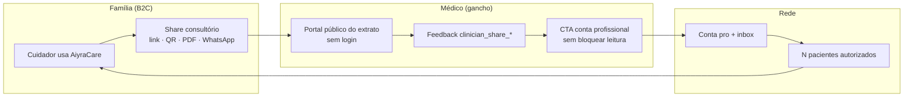
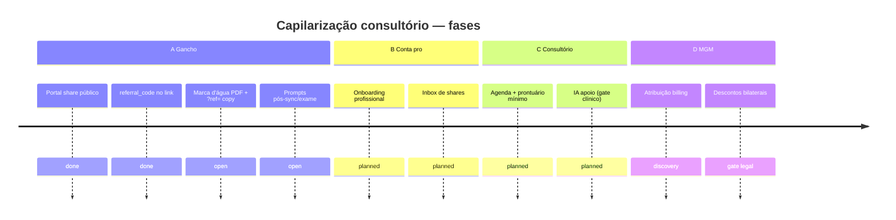

# GTM — capilarização consultório (família → médico → pacientes)

**Status:** estratégia viva (doc + CH) · **Decisor:** Rafael · **Atualizado:** 2026-10-07  
**Fontes:** Project store `growth-professional-capilaridade-2026-10-07`, [`referral-growth-loop.md`](../discovery/referral-growth-loop.md), feature [`patient-clinical-export`](../features/patient-clinical-export.md)

---

## Tese

1. O **cuidador** divulga de forma **implícita** ao usar valor real (consulta, extrato, dados normalizados).
2. O **médico** recebe valor **antes** de pagar (portal leve, dados úteis, tempo ganho).
3. O **ciclo inverte:** paciente puxa médico → médico puxa carteira de pacientes.
4. **Member-get-member bilateral** (futuro): mais pacientes pagantes reduz custo do médico; mais médicos na rede reduz custo do paciente — **regras e billing só após gate legal/fiscal** (ver [MGM](#mgm-regras-e-gate-legal)).

### Flywheel

---

## Fases A–D

| Fase | Nome | Objetivo | Estado |
|------|------|----------|--------|
| **A** | Gancho | Portal do extrato + feedback + CTA pro sem friction | Parcial — share D5 entregue; marca d'água e prompts contextuais em aberto |
| **B** | Conta pro | Serviços diferenciados (pacientes autorizados, inbox shares, notas — RBAC org 055) | Planejado |
| **C** | Consultório baixo custo + IA | Agenda leve, prontuário mínimo, IA **apoio** (não diagnóstico) — gate ANVISA/médico | Planejado |
| **D** | Pricing MGM | `referral_events`, desconto simétrico ou assimétrico | Discovery — **legal + fiscal antes de código** |

### Roadmap (timeline)

---

## Canais de chegada ao médico

| Canal | Produto hoje | Próximo |
|-------|----------------|---------|
| PDF impresso + marca d'água + QR | PDF consulta; **marca branded** pendente | Spec visual + `?ref=` na copy |
| QR → conteúdo normalizado | Share token + portal público D5 | Destaque «dado normalizado» para o médico |
| WhatsApp / mensageria | Wizard com WhatsApp | Templates + deep link |
| «Compartilhe com seu médico» in-app | CTA **Levar na consulta** | Prompts contextuais pós-sync/exame |
| Link com atribuição | `referral_code` no share (066) | Billing/indicação fora MVP |

Detalhe técnico do share: [`patient-clinical-export.md`](../features/patient-clinical-export.md).

---

## MGM — regras e gate legal

Programa bilateral documentado em discovery — **não implementado**:

- Mecânica de atribuição, anti-fraude e modelos de desconto: [`referral-growth-loop.md`](../discovery/referral-growth-loop.md).
- **Gate obrigatório** antes de código de billing: parecer legal/LGPD + fiscal (subsídio, NFS-e, comunicação de incentivo).
- Telemetria atual (`referral_link_*`, `clinician_share_*`) **sem PHI** — base para funil norte.

---

## Métricas norte

| Métrica | Evento / proxy | Funil |
|---------|----------------|-------|
| Abertura do link | `referral_link_opened` | Share → interesse médico |
| Cadastro profissional | signup com `referral_code` | Interesse → conta |
| 1º paciente vinculado | vínculo autorizado no pro | Ativação rede |
| CAC consultório | ops / billing (futuro) | Eficiência vs orgânico |
| Satisfação médico | `clinician_share_*` feedback | Qualidade do gancho |

---

## Princípios (não negociar)

- **LGPD:** médico vê só o que o cuidador **compartilhou** (token/consentimento); sem PHI em marketing.
- **Ava/produto:** não substituir médico; valor pro = organização + tempo + continuidade.
- **Operador solo:** crescimento agentic (ops, suporte); Rafael = pricing, parcerias, gates regulatórios.

---

## Decisões abertas (Rafael)

- [ ] Marca d'água: logo + URL fixa ou QR único por share?
- [ ] Primeiro incentivo monetário: só médico, só paciente, ou bilateral desde dia 1?
- [ ] CRM/validação médico (CFM) no onboarding pro — obrigatório ou progressivo?

---

## Artefatos relacionados

| Artefato | Uso |
|----------|-----|
| [`GROWTH_CONSULTORIO_BOARD.json`](./GROWTH_CONSULTORIO_BOARD.json) | Board machine-readable — CH **Produto → Capilarização** |
| [`PRODUCT_MATURITY_BOARD.json`](./PRODUCT_MATURITY_BOARD.json) | Itens GTM no quadro de maturidade |
| CH Estratégia → **Capilarização consultório** | Resumo executivo + mesmos diagramas |
| Feature card [`growth-consultorio-capilaridade.md`](../features/growth-consultorio-capilaridade.md) | Tier 0 — rastreio de capacidade |
