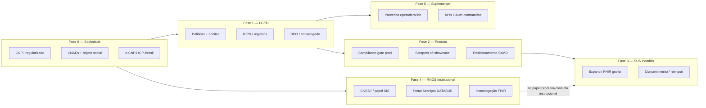

# Plano de aderência regulatória e interoperabilidade — AiyraCare

> **Autor:** thread «Análise Jev e POCs» · **2026-09-30**  
> **Contexto:** pesquisa interoperabilidade (Project store) · [connect-showcase-not-production.md](principles/connect-showcase-not-production.md)  
> **Paralelo Rafael:** regularização do **CNPJ** atual → depois **CNAEs** e objeto social  
> **Não é assessoria jurídica, contábil ou regulatória** — validar cada passo com contador, advogado (saúde + LGPD) e, na trilha RNDS, com o MS/DATASUS.

## Objetivo

Sair de “app que consome portal” para **operador de saúde digital aderente**: LGPD sólida, produto alinhado a **ESD/RNDS (FHIR)** no SUS, integrações privadas só por **contrato**, scrapers **apenas showcase**.

**Não significa** virar hospital, operadora ou PEP certificado SBIS — o enquadramento alvo continua **organizador familiar B2C** (`docs/LEGAL_COMPLIANCE.md`), com trilhas oficiais onde couber.

---

## Visão em trilhas (podem correr em paralelo)

---

## Fase 0 — Fundação societária (em andamento · Rafael)

| # | Entrega | Detalhe | Responsável | Evidência |
|---|---------|---------|-------------|-----------|
| 0.1 | **CNPJ regularizado** | Situação cadastral, endereço, sócios, procurações | Rafael + contador | Comprovante CNPJ ativo |
| 0.2 | **Objeto social** | Descrever: plataforma digital de **organização de informações de saúde familiar**, hospedagem de aplicação, interoperabilidade com sistemas autorizados pelo titular — **sem** atividade de estabelecimento de saúde presencial, salvo se deliberarem outro modelo | Jurídico + contador | Contrato social / alteração |
| 0.3 | **CNAEs (hipótese — validar com contador)** | Ver tabela abaixo | Contador | Receita Federal / Junta |
| 0.4 | **Certificado e-CNPJ** | Obrigatório para trilha RNDS institucional e muitos portais gov | Rafael | ICP-Brasil A1/A3 |
| 0.5 | **Conta PJ + fiscal** | NFS-e, Stripe na PJ, alinhado Contabilizei | Rafael | Emissão NFS teste |

### CNAEs — referência para discussão com contador

| CNAE | Uso provável AiyraCare | Principal / secundária |
|------|------------------------|-------------------------|
| **6203-1/00** | Desenvolvimento e licenciamento de programas **não customizáveis** (SaaS B2C, assinatura) | **Principal** candidata |
| **6311-9/00** | Tratamento de dados, provedor de aplicação, hospedagem na internet (nuvem, SaaS) | **Secundária** recomendada |
| **6202-3/00** | Software customizável (se vender implantação white-label para operadora) | Secundária se houver B2B |
| **6204-0/00** | Consultoria em TI (projetos de integração para parceiros) | Opcional |
| **6201-5/01** | Desenvolvimento sob encomenda | Só se faturar projeto fechado por cliente |

**Evitar** CNAE de estabelecimento de saúde (ex. grupos 86.x) **enquanto** o produto for apenas organizador digital — mudaria expectativa regulatória (ANVISA, vigilância, CNES como prestador). Se no futuro houver **telemedicina** ou **prestador**, reavaliar com jurídico.

**Simples Nacional:** 6311-9/00 e atividades intelectuais podem envolver **Fator R** — contador deve simular Anexo III vs V.

---

## Fase 1 — LGPD e governança de dados (base para “regulamentado”)

| # | Entrega | Detalhe | Depende de |
|---|---------|---------|------------|
| 1.1 | **Política de privacidade + termos** | Versão publicada, aceite auditável (já há módulo `legal-compliance`) | 0.1 |
| 1.2 | **Bases legais por fluxo** | Matriz: cadastro, saúde sensível, menores, import SUS, import manual, showcase scrape | Jurídico |
| 1.3 | **RIPD / roteiro de impacto** | Tratamento em larga escala de dados sensíveis — documento vivo | Jurídico + produto |
| 1.4 | **Encarregado (DPO)** | Nomeado interno ou terceiro; canal titular | 0.1 |
| 1.5 | **Subprocessadores** | Supabase, GCP, OpenRouter/LLM, etc. — DPA e lista no privacy | 1.1 |
| 1.6 | **Direitos do titular** | Export, exclusão, correção — fluxo operacional (não só botão) | Produto + ops |
| 1.7 | **Segurança técnica** | Criptografia credenciais, RBAC família, auditoria ACL (já parcial no produto) | Engenharia |
| 1.8 | **ANPD** | Avaliar necessidade de comunicação de incidente / relato — playbook | Jurídico |

**Marco “Fase 1 OK”:** jurídico assina pacote mínimo B2C + checklist LGPD para go-live público **sem scrape privado**.

---

## Fase 2 — Produto e narrativa regulatória

| # | Entrega | Detalhe |
|---|---------|---------|
| 2.1 | **Gates de produção** | Desligar sync scrape payer/provider em prod; manter só gov.br/FHIR + manual + parceria |
| 2.2 | **Copy e marketing** | Não prometer “certificação SBIS”, “PEP”, “diagnóstico”; Ava como apoio, não substituto médico |
| 2.3 | **ANVISA SaMD** | Manter enquadramento **não dispositivo médico**; revisão se IA passar a “recomendar tratamento” |
| 2.4 | **CDC / assinatura** | Termos cancelamento, reembolso, suporte (`docs/legal/`) |
| 2.5 | **Showcase pack** | Ambiente demo, roteiro operadora, disclaimer “integração oficial em negociação” |
| 2.6 | **Atualizar `LEGAL_COMPLIANCE`** | Refletir decisão scrape + trilha RNDS (quando levar ao monorepo) |

---

## Fase 3 — Aderência SUS “eixo cidadão” (curto prazo técnico)

**O que já é aderente:** consumo **FHIR R4** via gov.br (`ConecteSUSGateway`) — ver `docs/SUS_CONECTESUS.md`.

### SUS não é o mesmo problema do scraper de operadora

| Trecho | Hoje | Risco / regularização |
|--------|------|------------------------|
| **Dados** (vacinas, exames ConecteSUS) | **HTTP FHIR R4** (`ehr-search-gateway`, `Composition`) após token | Alinhado ao padrão MS; expandir perfis RNDS |
| **Caderneta** | APIs REST (`gerenciador-superapp-api.saude.gov.br`) após gov.br | APIs de governo, não HTML scrape — validar ToS e escopo |
| **Login / sessão** | **Browser** (Playwright) na 1ª vez; token `govbr-proxy` persistido; reimport **sem** browser | **Ponto a regularizar:** não é scrape de carteira, mas **automação de login** e uso de fluxo pensado para o app oficial — evoluir para **gov.br OAuth/OIDC** com cliente registrado (se MS permitir) ou canal formal de app cidadão |
| **Rotas no código** | `/scraper/conectesus` — nome legado | Renomear mentalmente para **import público**; não confundir com Connect payer |

**Sim — convém regularizar o SUS**, mas o trabalho é **autenticação + enquadramento institucional**, não substituir FHIR por parceria com operadora.

| # | Entrega | Detalhe |
|---|---------|---------|
| 3.1 | **Expandir documentos FHIR** | Mais tipos de `List` / `Composition` / REL conforme guias RNDS quando expostos ao cidadão |
| 3.2 | **Consentimento e transparência** | UI: origem SUS, última importação, reimport, expiração sessão gov.br |
| 3.3 | **Minimização** | Não reter cópia bruta FHIR além do necessário; política de retenção |
| 3.4 | **Terminologia BR** | Códigos MS (ex. imunobiológicos) — já parcial em `vaccine-catalog` |
| 3.5 | **Contato exploratório MS** | Pergunta formal: papel de **aplicação cidadã** que importa com gov.br vs credenciamento RNDS completo |

**Marco “Fase 3 OK”:** produto SUS em produção documentado; roadmap `sus-reimport` / expansão FHIR priorizado.

---

## Fase 4 — RNDS institucional (médio prazo · depende de papel jurídico)

Trilha oficial ([FAQ RNDS](https://webatendimento.saude.gov.br/faq/rnds), [Portal DATASUS](https://servicos-datasus.saude.gov.br/), [rnds-fhir.saude.gov.br](https://rnds-fhir.saude.gov.br/)):

| # | Passo oficial | Ação Aiyra | Nota |
|---|---------------|------------|------|
| 4.1 | Definir **papel** | **Consumidor** só cidadão (Fase 3) **ou** **SIS integrador** (envio/consulta institucional) | Integrador exige **CNES** e vínculo com estabelecimento — jurídico define se Aiyra abre CNES digital ou **parceia** CNES de terceiros |
| 4.2 | **CNES** (se integrador) | Cadastro estabelecimento / serviço de telessaúde ou similar — **validar viabilidade** para SaaS puro | Pode ser o maior bloqueio; alternativa é **nunca** ser produtor RNDS e só consumir canal cidadão |
| 4.3 | Solicitação **Portal Serviços DATASUS** | Sistema solicitante, IPs, portfólio (REL, RIA, RAC, etc.) | Requer 0.4 e 4.1 |
| 4.4 | **Homologação** | Testes FHIR, evidências, validador perfis RNDS | Engenharia + QA |
| 4.5 | **Produção** | Certificado + token EHR Auth; endpoints por UF | Ops |
| 4.6 | **Capacitação** | Curso UNASUS / materiais IG RNDS | Time técnico |

**Decisão pendente (registrar com jurídico):**  
- **Caminho A — Cidadão apenas:** não credenciar RNDS como hospital; fortalecer Fase 3 (menor fricção regulatória).  
- **Caminho B — SIS / parceiro:** credenciamento para **enviar** resumo clínico gerado pelo Aiyra (ex. export família) ou **consultar** como profissional — exige CNES + contratos.

---

## Fase 5 — Suplementar (operadoras, labs, hospitais)

| # | Entrega | Detalhe |
|---|---------|---------|
| 5.1 | **Pipeline comercial** | Lista alvo (Unimed singular, regional, lab) + showcase scraper |
| 5.2 | **Due diligence** | ToS, LGPD, papel controlador/operador em contrato |
| 5.3 | **Integração técnica** | OAuth/API (modelo Dasa portal, Unimed Lab invertido) |
| 5.4 | **TISS** | Só se Aiyra entrar em fluxo prestador↔operadora — **fora do escopo B2C atual** |
| 5.5 | **ANS FHIR (PQDAS)** | Monitorar; consumir via RNDS no longo prazo, não API direta ao app |

---

## Cronograma sugerido (ordem lógica, sem datas)

| Ordem | Fase | Pode começar quando |
|-------|------|---------------------|
| 1 | **0** CNPJ/CNAE/e-CNPJ | **Agora** (Rafael) |
| 2 | **1** LGPD pacote go-live | CNPJ ok + jurídico |
| 3 | **2** Gates produto + showcase | Paralelo à 1 |
| 4 | **3** SUS FHIR cidadão | Paralelo |
| 5 | **4** RNDS institucional | Após decisão papel + CNES (jurídico) |
| 6 | **5** Parcerias privadas | Paralelo após showcase pronto |

---

## Checklist mestre (copiar para acompanhamento)

### Sociedade
- [ ] CNPJ regularizado
- [ ] Alteração contratual / CNAEs (6203-1/00 + 6311-9/00 hipótese)
- [ ] e-CNPJ ativo
- [ ] Objeto social alinhado ao produto

### LGPD
- [ ] Política + termos vivos
- [ ] RIPD
- [ ] DPO designado
- [ ] Matriz bases legais
- [ ] Playbook incidente

### Produto
- [ ] Scrapers fora de produção
- [ ] Showcase documentado
- [ ] Compliance gate em prod
- [ ] Revisão ANVISA/CFM copy

### SUS
- [ ] Roadmap expansão FHIR
- [ ] UX consentimento SUS
- [ ] (Opcional) ofício / contato DATASUS sobre app cidadão

### RNDS (se Caminho B)
- [ ] Decisão CNES
- [ ] Solicitação Portal DATASUS
- [ ] Homologação
- [ ] Produção

### Privado
- [ ] 1ª parceria piloto assinada
- [ ] Integração API em prod

---

## Próximos passos imediatos (Rafael)

1. **Contador:** levar este doc + objeto desejado; fechar **CNAE principal + secundárias** e impacto Simples/Fator R.  
2. **Jurídico (saúde + LGPD):** validar Caminho A vs B RNDS e se CNAE 86.x é necessário ou proibido para o modelo.  
3. **Coordinator produto:** criar épico roadmap `regulatory-adherence` espelhando fases 2–3.  
4. **Este thread:** opcional one-pager “pitch regulatório” para operadora (ganho mútuo + trilha FHIR/RNDS).

---

## Referências rápidas

| Tema | Link / doc |
|------|------------|
| Pesquisa interoperabilidade | [health-data-interoperability-research.md](health-data-interoperability-research.md) |
| Scraper só showcase | [connect-showcase-not-production.md](../principles/connect-showcase-not-production.md) |
| Legal monorepo | `docs/LEGAL_COMPLIANCE.md` |
| ConecteSUS | `docs/SUS_CONECTESUS.md` |
| RNDS IG FHIR | https://rnds-fhir.saude.gov.br/ |
| Portal DATASUS | https://servicos-datasus.saude.gov.br/ |
