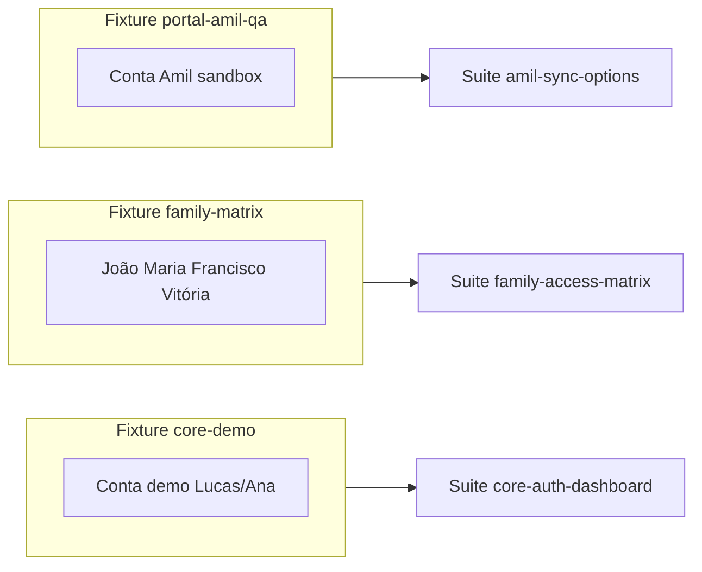

# Modelo de QA paralelo — massas isoladas

> **Última atualização:** 2026-09-08  
> Metáfora: **vários analistas QA** testando funcionalidades completas ao mesmo tempo, cada um com login, pacientes e estado próprios.

## Por que paralelo?

| Problema serial | Solução paralela |
|-----------------|------------------|
| Testar família quebra massa do teste Amil | Fixtures **isoladas** por suite |
| Um analista bloqueia outro | `parallelSafe: true` + contas distintas |
| “Testei tudo” vira um dia inteiro | Suites **por feature** executáveis sob demanda |
| Automação futura | Mesmo `suite-id` → spec Playwright independente |

## Conceitos



| Conceito | Definição |
|----------|-----------|
| **Suite** | Checklist completo de uma capacidade — cada ação do escopo |
| **Fixture** | Massa PG + contas Supabase + estado esperado |
| **Lane** | Grupo de suites (`regression`, `feature`, `integration-portal`, `ops`) |
| **parallelSafe** | Pode rodar simultaneamente com outras suites `parallelSafe` |

## Regras de isolamento

1. **Nunca** duas suites paralelas no mesmo `fixtureId` — estado compartilhado causa falso negativo.
2. Suite em lane `regression` usa `core-demo` e roda **em série** dentro da lane.
3. Portal sync: uma conta portal por executor; não reusar sessão entre suites.
4. Preview vs Dev: mesma fixture, bancos diferentes (`aiyracare` vs `aiyracare_preview`) — não rodar a mesma suite nos dois ao mesmo tempo com mesma conta se houver race.

## Catálogo de fixtures

| ID | Contas / personas | Seed / script | Usado por |
|----|-------------------|---------------|-----------|
| `core-demo` | Demo account + Lucas, Ana | `npm run seed:staging-refresh` + `link:demo-patients` | `core-auth-dashboard`, `regression-smoke` |
| `family-matrix` | João, Maria, Francisco, Vitória, filhos | `seed-qa-family-matrix.mjs` **(planejado)** | `family-access-matrix` |
| `portal-amil-qa` | Conta com link Amil sessionReady | Manual / credenciais locais `.env` | `amil-sync-options` |
| `ops-local` | N/A — só API keys | `OPS_METRICS_KEY` em `.env` | `ops-health` |

Detalhes: [`fixtures/README.md`](./fixtures/README.md).

## Orquestração manual

### Uma suite

```powershell
npm run qa:run -- --suite family-access-matrix
```

### Paralelo (3 “QAs”)

Pedido no chat:

> Rode em paralelo: `family-access-matrix`, `amil-sync-options`, `ops-health`

Agente:

1. Valida `parallelSafe` no `index.json`
2. Confirma fixtures distintas
3. Abre 3 contextos (tabs ou subagentes)
4. Consolida 3 relatórios → veredito por suite

### Regressão `main` (série)

```powershell
npm run qa:run-all -- --lane regression
```

Não paralelizar dentro da lane `regression`.

## Evolução para CI

Cada fixture ganha variante **efêmera** no CI:

- Job matrix: `suite-id` × `postgres:16` container
- Seed aplicado no job antes do Playwright
- Mesmos passos da suite `.md` viram `test()` no spec

Isso preserva o modelo paralelo: CI roda N jobs simultâneos, um por suite `parallelSafe`.
