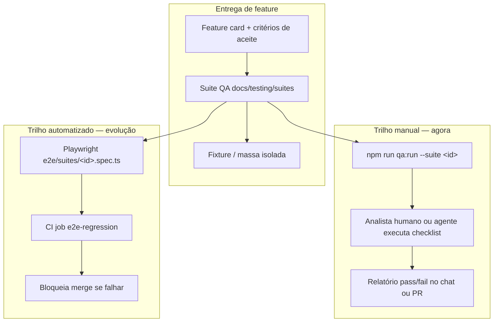
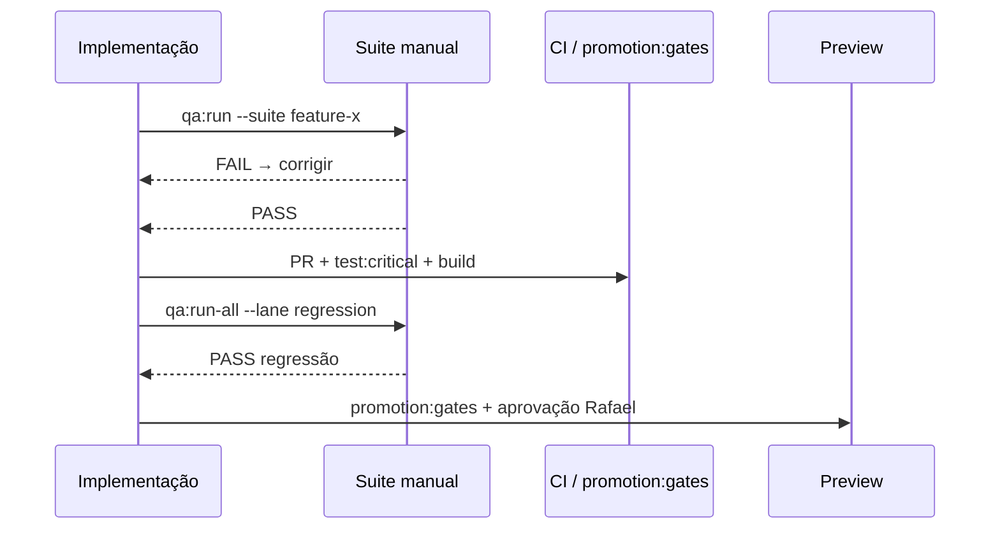

# Processo QA — AiyraCare

> **Última atualização:** 2026-09-08  
> **Princípio:** feature **não está entregue** sem plano de teste executável; push em `main` exige **regressão** do núcleo (manual hoje → automatizado em CI).

## Visão geral

Dois trilhos **em paralelo**, mesma definição de “pronto para teste”:



| Trilho | Quando | Quem |
|--------|--------|------|
| **Manual solicitável** | Sempre que Rafael/agente pedir “testa X”; antes de promoção Preview; validação de feature nova | Humano ou agente com browser |
| **Automatizado** | Cada PR/`main` (meta); hoje só smoke mínimo no CI | GitHub Actions + Playwright |

**Regra:** a suite manual é a **especificação**; o E2E automatizado é a **implementação** da mesma suite — não dois checklists divergentes.

### Teste completo (expectativa Rafael)

**Toda ação de negócio acionável na UI** deve ser exercitada na suite da feature — em geral **CRUD** (criar → ver → editar → excluir) ou ciclo equivalente (convite → aceite → revogar).

| Camada | Documento |
|--------|-----------|
| Matriz mestra (todas as ações) | [`BUSINESS_ACTION_MATRIX.md`](./BUSINESS_ACTION_MATRIX.md) |
| Paciente CRUD | [`core-patient-crud`](./suites/core-patient-crud.md) |
| Exames, docs, meds… | suites `patient-*-crud` |
| Ava (smoke, sem qualidade LLM) | [`AVA_QA_SCOPE.md`](./AVA_QA_SCOPE.md) + lane `ava` |

**Fora do “completo” agora:** qualidade de resposta LLM / OCR de documentos; portais com WAF (lane `integration-portal`).

```powershell
# Gate rápido main
npm run qa:run-all -- --lane regression

# Teste completo de negócio (horas — paralelizar por domínio)
npm run qa:run-all -- --lane business-full

# Só Ava
npm run qa:run-all -- --lane ava
```

---

## Definition of Done (feature)

Uma capacidade só vai para `done` no roadmap quando:

| # | Critério | Artefato |
|---|----------|----------|
| 1 | Critérios de aceite acionáveis | `docs/features/<id>.md` |
| 2 | Suite QA com **cada ação de negócio** na UI (CRUD) | `docs/testing/suites/<suite-id>.md` + linha em [`BUSINESS_ACTION_MATRIX.md`](./BUSINESS_ACTION_MATRIX.md) |
| 3 | Massa de teste documentada | `docs/testing/fixtures/<fixture-id>.json` |
| 4 | Entrada no catálogo | `docs/testing/suites/index.json` |
| 5 | Suite executada manualmente **pelo menos uma vez** após entrega | Relatório no PR ou `HISTORICO` |
| 6 | `automation.status` definido | `planned` mínimo; `done` quando spec Playwright existir |

Tier ≥ 2: além disso, skills `aiyracare-review-*` conforme [`FEATURE_REVIEW_FRAMEWORK.md`](../FEATURE_REVIEW_FRAMEWORK.md).

---

## Lanes (execução paralela)

Cada suite pertence a uma **lane** — grupo de suites que podem rodar ao mesmo tempo sem conflito de dados.

| Lane | Uso | `parallelSafe` |
|------|-----|----------------|
| `regression` | Gate pré-`main` / smoke integrado do núcleo | Suites **sequenciais** entre si (compartilham fixture `core-demo`) |
| `feature` | Validação da feature entregue | `true` se fixture própria |
| `integration-portal` | Sync real (Unimed, Amil, Fleury…) | `true` — contas portal dedicadas |
| `ops` | Console, alertas, suporte | `true` — fixture `ops-local` |

Ver [`PARALLEL_QA_MODEL.md`](./PARALLEL_QA_MODEL.md).

---

## Gate em push para `main`

### Hoje (operacional)

Antes de `git push origin main`:

```powershell
# 1. Gates técnicos (já no CI, rodar local se quiser confiança)
npm run promotion:gates

# 2. Regressão funcional manual do núcleo
npm run qa:run-all -- --lane regression
```

O agente ou Rafael reporta: **✅ passou** / **❌ falhou** (suite + passo) / **⚠️ decisão**.

### Meta (próximas entregas — ver AUTOMATION_ROADMAP)

CI job `e2e-regression`: PG efêmero + seed + API + Playwright executando a lane `regression` automaticamente em cada push/PR.

---

## Formato de relatório (obrigatório)

Ao concluir uma suite manual ou regressão:

```markdown
## QA — <suite-id> — <data>

**Ambiente:** dev | preview  
**Fixture:** <fixture-id>  
**Executor:** Rafael | agente | CI  

| Passo | Resultado | Notas |
|-------|-----------|-------|
| 1. … | ✅ / ❌ / ⚠️ | … |

**Veredito:** PASS | FAIL | BLOCKED (dependência externa)
```

Para regressão `main`: anexar ao PR ou linha em `docs/HISTORICO.md` se push direto.

---

## Ambientes

| Ambiente | API | Web | PG | Quando testar |
|----------|-----|-----|-----|---------------|
| **Dev (1)** | `:3010` | `:5173` | `aiyracare` | Desenvolvimento diário |
| **Preview (2)** | `:3020` | `:5174` | `aiyracare_preview` | Antes de go-live; e-mail Resend |

```powershell
npm run up              # dev
npm run up:preview      # preview
npm run qa:run -- --suite family-access-matrix --preview
```

**Atenção:** migrations devem existir em **ambos** os bancos — ver [`infra/ENVIRONMENTS.md`](../infra/ENVIRONMENTS.md#pitfall-migrations-dual-db).

---

## O que não entra no gate automático (por enquanto)

| Área | Motivo | Onde testar |
|------|--------|-------------|
| Login portal Unimed/Amil/Fleury | WAF, sessão, CDP | Lane `integration-portal`, manual |
| E-mail transacional Resend | API key externa | Preview + `RESEND_API_KEY` |
| LLM Ava (qualidade de resposta) | Não determinístico | Smoke + guardrails unitários; review médico tier 3 |

---

## Integração com entrega



---

## Próximos passos (épico `qa-e2e-platform`)

1. Seed `family-matrix` (`seed-qa-family-matrix.mjs`)
2. `packages/web/e2e/suites/core-auth-dashboard.spec.ts`
3. Job CI com stack integrada
4. Tornar `qa:run-all --lane regression` redundante com CI (manual só para debug)

Ver [`AUTOMATION_ROADMAP.md`](./AUTOMATION_ROADMAP.md) e `docs/roadmap.json` → épico `qa-e2e-platform`.
