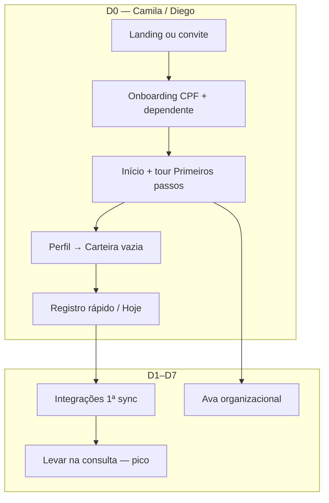

# Experiência / CX — Round 1 (novo usuário)

> **Atualizado:** 2026-09-18 · **Método:** revisão heurística (docs + i18n + fluxos web) simulando **cuidador novato** — **não** execução em staging ainda ([Round 2](./experience-simulation-round2-plan.md))  
> **Contraste:** QA ACL = [`family-matrix`](../../workspace/docs/testing/fixtures/family-matrix.json) (João/Maria/…) · CX = conta fresca, zero conhecimento de grants  
> **Terminologia canônica:** repo `docs/product-terminology.md` (espelho conceitual alinhado a [marketing-strategy-round1](./marketing-strategy-round1.md))

---

## TL;DR (45 s)

| | |
|--|--|
| **Veredito** | Base B2C **sólida** (Sua família, Quem ver hoje, tour Primeiros passos) — risco em **D0**: formulário pesado (CPF), **Hoje ausente no Início** até existir perfil + lente, **expectativa de sync** na Carteira vs realidade «Integrações na 1ª vez», modais empilhados (compliance + tour). |
| **Pico desejado (marketing)** | Carteira útil ou 1º registro rápido — hoje muitos novatos só veem **vazio + texto** antes do pico. |
| **Quick wins (S2→S3)** | Ordem pós-login; hint único «próximo passo» no Início vazio; reforço Carteira→Integrações; tour passo sync **expectativa** (copy, não código). |
| **Estrutural (S1)** | Reduzir atrito CPF D0 (progressive disclosure pós-1º valor); garantir bloco Hoje visível assim que houver ≥1 dependente; créditos IA menos assustadores no 1º dock. |
| **Próximo passo** | [experience-simulation-round2-plan.md](./experience-simulation-round2-plan.md) em `:5174` |

---

## Método e limites

- **Round 1:** walkthrough mental + código/i18n (`onboarding.tsx`, `dashboard.tsx`, `DashboardDayToDaySection`, `FirstVisitTourDrawer`, `walletCards`, `first-visit-guided-ux`).
- **Não mediu:** tempo real, mobile touch, taxa de abandono — hipóteses para Round 2.
- **Frameworks aplicados:** progressive disclosure · carga cognitiva · peak–end · recuperação de erro · confiança em health apps · novato vs expert · mobile-first · Nielsen (visibilidade status, consistência, prevenção erro, ajuda reconhecível).

---

## Personas «novo usuário» (PT-BR, fictícias)

### 1. Camila — mãe pós-parto (pediatria + convênio)

| | |
|--|--|
| **Contexto** | 32 anos, bebê 6 semanas, consulta pediatria em 10 dias, Unimed BH, pouco sono. |
| **Objetivo** | Cadastrar o bebê, anotar mamadas/febre, ter carteirinha «decente» antes da consulta. |
| **Medo** | Errar dado do filho; app «vazar» CPF; Ava falar como se fosse médico. |
| **Sucesso D7** | ≥1 registro rápido; sabe onde exportar ou «Levar na consulta»; entende que sync exige conectar portal **uma vez**. |

### 2. Diego — pai com TDAH, pouco tempo

| | |
|--|--|
| **Contexto** | 38 anos, filho 4 anos, usa app 2–3 min no intervalo do trabalho. |
| **Objetivo** | Abrir → registrar sintoma → fechar. |
| **Medo** | Formulário longo; perder fluxo entre modais; esquecer onde estava. |
| **Sucesso D7** | Registro rápido em **≤4 toques** após 1º dia; não precisou ler manual. |

### 3. Renata — familiar convidada (não titular)

| | |
|--|--|
| **Contexto** | 45 anos, cunhada convidada para ajudar com a criança; nunca ouviu falar do AiyraCare. |
| **Objetivo** | Aceitar convite, ver só o que precisa, registrar algo no dia a dia. |
| **Medo** | Aceitar «errado» e ver dados de adultos; não entender diferença conta vs família. |
| **Sucesso D7** | Aceite claro; dashboard coerente com convite; sabe pedir ajuda ao titular se Integrações falhar. |

### 4. Lucas — retorno após ~2 semanas (opcional)

| | |
|--|--|
| **Contexto** | Voltou porque consulta marcada; cadastrou na pressa e pulou dependentes/sync. |
| **Objetivo** | Reencontrar Integrações, Carteira, export. |
| **Medo** | Parecer «burro» porque esqueceu; app parecer vazio demais. |
| **Sucesso** | Em 5 min relembra: perfil → Carteira vs Integrações → registro rápido. |

---

## Mapas de jornada P0

Legenda: **F** = fricção hipotética · **T** = check terminologia vs `product-terminology.md`

### Fluxo A — Signup / login → onboarding

| Etapa | Camila | Diego | Renata | Lucas | Copy / T |
|-------|--------|-------|--------|-------|----------|
| Landing `/home` | Quer CTA claro «família» | Igual, impaciente | Pode chegar só por convite | — | ✅ alinhado marketing |
| Signup / login | E-mail confirmação (informativo) OK | Odeia passos extras | Conta nova no aceite | Login direto | Gap auth doc: confirmação não bloqueia |
| Compliance LGPD | Necessário; **F:** mais um bloqueio antes de «ver filho» | **F:** empilha | **F:** duplo com convite | Já aceito | Trust OK se copy curta |
| Onboarding 1 — titular | **F:** CPF obrigatório + sexo + data — alta carga | **F:** abandono aqui | Pode pular se só convidada? (conta própria ainda exige titular) | — | ✅ «Seu perfil»; ⚠️ «titular» técnico |
| Onboarding 2 — dependentes | Quer bebê já; consentimento menor OK | Pula → arrepende depois | N/A no D0 | Pulou na 1ª vez | ✅ «Quem você acompanha» |
| Fim → Início | Espera ver bebê; **F:** tour modal 600ms depois | **F:** modal + empty | — | — | Peak fraco se só form |

### Fluxo B — Primeiro perfil → Carteira / Hoje

| Etapa | Camila | Diego | Renata | Notas produto |
|-------|--------|-------|--------|---------------|
| Início «Sua família» | Cards por idade — bom progressive | Quer atalho Hoje | Lista restrita ao grant | ✅ `patient.title` |
| Bloco **Hoje** no Início | **F:** `DashboardDayToDaySection` **null** se 0 perfis ou sem `patientId` | Se pulou dependente, **sem Hoje** | Igual | S1 hipótese — novato pula passo 2 |
| Entrar perfil → aba **Carteira** | Empty carteirinha + hint sync | Não acha Integrações | Só vê perfis permitidos | ✅ `walletCards.noCards` |
| Expectativa sync | **F:** «atualização automática» lido como mágico | Igual | Depende do titular | Silent sync exige sessão — marketing disclaimer |
| **Registro rápido** | Header / tour | Meta principal | Mesma lente | ✅ «Quem ver hoje» |

### Fluxo C — Integrações (expectativa novato)

| Etapa | Hipótese F | Recuperação desejada |
|-------|------------|----------------------|
| Descobrir aba | **F:** escondida vs Carteira/Convênios | Carteira empty → CTA «Conectar em Integrações» (1 caminho) |
| 1ª sync manual | **F:** Chrome/portal assusta | Copy «normal na 1ª vez» + progress modal |
| Falha silent | **F:** `silentSyncFailed` no Início | Ação única «Sincronizar» — ✅ mensagem existe |

### Fluxo D — Ava dock (1ª abertura)

| Etapa | Camila | Diego | T |
|-------|--------|-------|---|
| Orb FAB | Curiosa se confiável | Pode ignorar | Disclaimer curto ✅ |
| Tour passo Ava | **F:** disabled sem `patientId` se pulou dependentes | — | Seed message acolhedora ✅ |
| Créditos IA | **F:** `quotaHint` parece cobrança imediata | — | Cruzar [finance-strategy-round1](./finance-strategy-round1.md) — franquia grátis |

---

## Jornada por persona (síntese)

- **Renata:** entra em `L` via `/invite/accept` → compliance → Início **sem** onboarding de bebê (se grants prontos) — **F:** mental model «por que pedem meus dados?».
- **Lucas:** pula `O` parcial → `P` vazio → **F:** não encontra `S`.

---

## Contraste: novato vs matriz QA (`family-matrix`)

| Dimensão | Novo usuário (CX) | Power QA (matriz) |
|----------|-------------------|-------------------|
| Contas | 1 login, zero grants | 5 logins, Mariana A+B |
| Objetivo teste | «Entendo o app em 15 min?» | «ACL está correto?» |
| Família | Um círculo implícito | Círculos A/B, revogação |
| Convite | 1 cunhada feliz | Maria sem Mariana |
| **Erro comum** | Usar `qa.e2e` + demo rico → **falso positivo** de UX fácil |

---

## Achados — tabela de severidade (Round 1)

| ID | Achado | Sev | Personas | Framework |
|----|--------|-----|----------|-----------|
| H1 | Modais seguidos: compliance + «Primeiros passos» (+ onboarding longo) | **S2** | C, D | Carga cognitiva, peak–end |
| H2 | Bloco **Hoje** no Início não renderiza sem perfil/lente — novato que pula passo 2 fica sem «dia a dia» no hub | **S1** | D, L | Progressive disclosure invertida |
| H3 | Carteira promete sync automático; novato não sabe que **Integrações + 1ª sessão** são obrigatórios | **S2** | C, R | Confiança / expectativa |
| H4 | Tour Ava **disabled** sem perfil selecionado — fim do guia anticlimático | **S2** | D | Peak–end |
| H5 | CPF obrigatório no D0 antes de qualquer valor percebido | **S2** | C, D | Trust + carga cognitiva |
| H6 | Três superfícies próximas: **Convênios**, **Integrações**, **Carteira** | **S3** | C, L | Nielsen consistência |
| H7 | Créditos IA no dock na 1ª conversa | **S3** | C | Finance + ansiedade |
| H8 | Terminologia B2C majoritariamente correta; outlier billing «pacientes» no plano | **S4** | — | Terminologia |
| H9 | `first-visit-guided-ux` acolhe empty clínico — bom vs alertas | ✅ | C | Health UX |
| H10 | Registro rápido + «Quem ver hoje» consistentes | ✅ | Todos | Terminologia |

**Legenda:** S1 ativação · S2 fricção forte · S3 polish · S4 backlog copy

---

## Quick wins vs structural

### Quick wins (copy / ordem / empty states — sem épico grande)

| Ação | Resolve | Esforço |
|------|---------|---------|
| Início vazio: **1 card** «Próximo passo: adicionar quem você cuida» + botão (além de Empty) | H2 parcial | Baixo |
| Carteira vazia: botão primário **Ir para Integrações** (já há hint texto) | H3 | Baixo |
| Tour: passo 0 menciona «depois conectamos convênio» (expectativa) | H3 | Baixo |
| Delay tour +600ms **ou** só após dismiss compliance | H1 | Baixo |
| Billing string: «pacientes» → «perfis» / «família» | H8 | Baixo |
| Link ajuda convite: 1 frase «Você verá apenas os perfis que [nome] compartilhou» | Renata | Baixo |

### Structural (produto / roadmap)

| Ação | Resolve | Notas |
|------|---------|-------|
| CPF titular **após** 1º dependente ou 1º registro (progressive) | H5 | Legal/LGPD review |
| Hoje no Início com CTA quando `patients.length===0` (estado educativo) | H2 | `DashboardDayToDaySection` |
| Wizard onboarding opcional «só cadastrar filho» (titular mínimo) | H5, C | Onboarding 2 steps |
| Spotlight tour opcional (feature card diz fora de escopo) | H6 | P2 `first-visit-guided-ux` |
| Onboarding sync «demo» Bradesco/manual antes de portal real | H3 | Integrações |

---

## Terminologia — amostra auditada (i18n)

| Onde | Texto | Veredito |
|------|-------|----------|
| Início | «Sua família» | ✅ |
| Onboarding | «Quem você acompanha?» | ✅ |
| Lente | «Quem ver hoje» | ✅ |
| Carteira | «Sincronização em Integrações» | ✅ claro para expert; novato precisa CTA |
| Ava | «não substitui consulta médica» | ✅ health UX |
| Plano família (landing/billing) | «mais pacientes» | ⚠️ trocar |

---

## Alinhamento marketing × finance × CX

| Fonte | Implicação UX |
|-------|----------------|
| [marketing-strategy-round1](./marketing-strategy-round1.md) | Promessa **Carteira + registro + consulta** — D0 deve mostrar caminho em ≤3 min, senão funil `onboarding_step` → ativação cai |
| [finance-strategy-round1](./finance-strategy-round1.md) | Franquia grátis + plano família **test** — UI não pode parecer paywall no 1º dock; placeholder preço na landing ≠ checkout público |
| Métricas | Monitorar `first_visit_tour_completed` (dismiss vs finished), `quick_capture_saved`, `sync_job_terminal` **por cohort novato** (conta &lt;7d) |

---

## Primeira visita — feature `first-visit-guided-ux`

| Aspecto | CX |
|---------|-----|
| Modal 4 passos | Bom **novato**; não substitui spotlight no DOM |
| Dismiss = completed | Risco **peak–end** negativo se usuário fechou à toa — considerar «Continuar depois» sem marcar completed |
| FamilySupportPanel | Reduz ansiedade diagnóstica no empty — manter |

---

## Próximos passos

1. Executar [experience-simulation-round2-plan.md](./experience-simulation-round2-plan.md) no worker (`:5174`).
2. Confirmar H1–H5 com screenshots em `media/cx-round2/`.
3. Devolver top 3 quick wins ao pipeline produto (sem commit repo salvo pedido explícito).
4. Skill recorrente: [skills/experience-advisor.md](./skills/experience-advisor.md).

---

## Links

| Doc | Uso |
|-----|-----|
| [marketing-strategy-round1](./marketing-strategy-round1.md) | ICP, loops, métricas |
| [finance-strategy-round1](./finance-strategy-round1.md) | Créditos, checkout, claims |
| [experience-simulation-round2-plan.md](./experience-simulation-round2-plan.md) | Validação staging |
| [skills/experience-advisor.md](./skills/experience-advisor.md) | Agentes futuros |
| Repo `docs/features/first-visit-guided-ux.md` | Tour |
| Repo `docs/features/auth-entry-onboarding.md` | Wizard |
