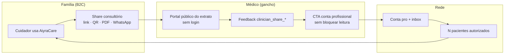
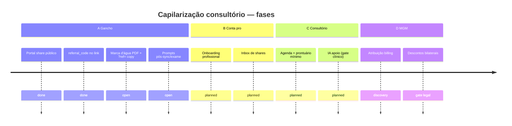

# Capilarização consultório — resumo executivo

> **Atualizado:** 2026-10-07 · **Público:** Rafael + agents (CH) · **Sem PHI**  
> **Canônico no repo:** [`docs/product/GROWTH_CONSULTORIO_CAPILARIDADE.md`](https://github.com/RafaDru/aiyra-care/blob/main/docs/product/GROWTH_CONSULTORIO_CAPILARIDADE.md)

---

## TL;DR

| | |
|--|--|
| **Tese** | Cuidador usa valor real → share na consulta → médico ganha tempo no portal → CTA conta pro → rede de pacientes |
| **Hoje** | Fase **A** parcial: wizard **Levar na consulta**, portal público D5, `referral_code`, feedback `clinician_share_*` |
| **Próximo** | Marca d'água PDF, prompts contextuais; depois conta pro (B), consultório leve (C), MGM com gate legal (D) |
| **Não fazer agora** | Descontos bilaterais em billing sem parecer legal/fiscal |

---

## Flywheel

---

## Fases (A–D)

| Fase | Foco | Estado |
|------|------|--------|
| **A — Gancho** | Portal + CTA pro | Parcial |
| **B — Conta pro** | Inbox, RBAC org | Planejado |
| **C — Consultório** | Agenda + prontuário mínimo + IA apoio | Planejado |
| **D — MGM** | Indicação bilateral | Discovery + gate legal |

---

## Métricas norte (telemetria)

1. `referral_link_opened` → interesse médico  
2. Signup profissional com atribuição  
3. 1º paciente vinculado na conta pro  
4. CAC consultório (futuro ops/billing)  
5. `clinician_share_*` — qualidade do gancho  

---

## Decisões abertas (Rafael)

- Marca d'água: logo + URL fixa vs QR por share  
- Primeiro incentivo: médico, paciente ou bilateral  
- CFM no onboarding pro: obrigatório vs progressivo  

**Board vivo (Produto → Capilarização):** `docs/product/GROWTH_CONSULTORIO_BOARD.json`
