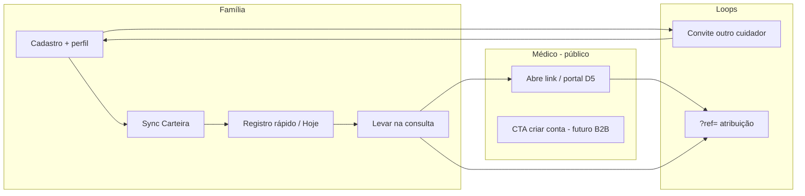

# Marketing — estratégia round 1 (pré-go-live)

> **Atualizado:** 2026-09-18 · **Público:** Rafael (solo) · **Fase:** MVP local / A2 preview — **sem CNPJ**, Stripe **test**, go-live público bloqueado  
> **Fontes:** `docs/PROJETO.md`, `docs/FOCO_ATUAL.md`, `docs/roadmap.json`, `docs/product-terminology.md`, [roadmap-dashboard](./roadmap-dashboard.md)

---

## TL;DR (30 s)

| | |
|--|--|
| **Quem** | Cuidador familiar (pais, responsáveis) que gerencia saúde de filhos e dependentes no Brasil |
| **Promessa** | Um lugar para **histórico de saúde da família**, convênio na **Carteira**, dia a dia em poucos toques, **exportar para consulta** sem montar pasta na hora H |
| **Onde crescer agora** | Uso real (Rafael + beta fechado), **D4** (médico vê extrato + `?ref=`), convites família, **orgânico** e landing `/home` — **não** mídia paga em escala |
| **Medir** | Funil de **ativação** + **WAU** no console ops (`product_events`) — ver [métricas](#métricas-pré-cnpj) |
| **Bloqueios** | Preço público final, descontos referral, ads com checkout → [finance-strategy-round1](./finance-strategy-round1.md) + `human-review-gates` |

---

## Posicionamento de marca

### Categoria mental

**Assistente de saúde da família** — não hospital, não prontuário eletrônico do consultório, não “Dr. Google”.

### Proposta de valor (uma frase)

> **Menos caça aos portais. Mais clareza na consulta.**

### Pilares (ordem de comunicação)

1. **Centralização** — convênio, exames, consultas e registros do dia a dia num só fluxo (sync + captura rápida).
2. **Preparação para consulta** — wizard «Levar na consulta» (link, QR, PDF) como momento “uau” compartilhável.
3. **Parceria contínua** — Ava como companheira no app (apoio organizacional; **não** diagnóstico).
4. **Família multi-cuidador** — convites, círculos, permissões (diferencial vs. app de operadora).

### Personalidade de voz

| Sim | Não |
|-----|-----|
| Calor humano, direto, “você” | Jargão clínico na home |
| Empatia com sobrecarga do cuidador | Alarmismo ou promessa de cura |
| Honestidade (mock → screenshot real já na landing) | Logos de operadora sem parecer jurídico |
| Português BR inclusivo (família, pessoa, perfil) | “Paciente” como rótulo B2C |

### Diferenciação honesta (pré-go-live)

- **Sync** com portais reais (Unimed, Amil, labs, SUS guiado) — diferencial técnico forte; comunicar com **disclaimer** (depende de sessão do portal, máquina local hoje).
- **Export clínico + portal médico leve (D5)** — canal de aquisição indireta via profissional impressionado.
- **Não competir** com app da operadora em “rede credenciada”; competir em **visão 360 da família** e **preparação da consulta**.

---

## ICP — cuidador familiar

### Primário (beachhead)

| Atributo | Perfil |
|----------|--------|
| **Quem** | Pai/mãe ou responsável legal, 28–45 anos, classe B/C+, smartphone |
| **Contexto** | 1–3 dependentes (foco pediátrico no produto hoje); plano de saúde com portal |
| **Dor** | PDFs espalhados, guias no app da operadora, esquecer vacina/medida, chegar na consulta sem histórico |
| **Gatilho** | Consulta agendada, filho doente, troca de pediatra, segunda opinião |
| **Job to be done** | “Quero chegar na consulta com o histórico organizado e continuar registrando o dia a dia sem planilha” |

### Secundário (fase 2)

- Cuidador de **adulto dependente** (idoso) — mesma mecânica, copy a ajustar depois.
- **Outro cuidador na família** (avó, babá com grant) — loop `family_invite_*`.

### Anti-ICP (não perseguir agora)

- Hospitais, operadoras B2B, RH corporativo.
- Usuário que só quer **um** PDF da Unimed sem cadastro recorrente.
- Médico como **cliente pagante** (B2B) — discovery separado; não misturar mensagem B2C na landing.

### Persona rápida (exemplo fictício — sem PHI)

**Marina**, 34, mãe de dois, Unimed + pediatra particular. Usa WhatsApp para mandar foto de receita. Uma semana antes da consulta anual, quer timeline + carteirinha atualizada. Indica o app à cunhada depois de usar «Levar na consulta».

---

## Mensagens × terminologia B2C

Canônico: repositório `docs/product-terminology.md` (espelho conceitual no Project store quando existir).

| Contexto | Use | Evite (B2C) |
|----------|-----|-------------|
| Hero / ads | Sua família, histórico de saúde, Carteira | Prontuário, paciente, dashboard |
| Sync | Conectar convênio / portal | Scraping, robô |
| Dia a dia | Registro rápido, bloco Hoje | EHR, prontuário |
| Consulta | Exportar para consulta, levar na consulta | “Substitui prontuário oficial” (só disclaimer no PDF) |
| Ava | Companheira, organizar, tirar dúvidas **informativas** | Diagnóstico, prescrição, “médico virtual” |
| Billing (landing) | Plano família, franquia grátis de interpretação | “Ilimitado” sem ressalva de créditos |

### Headlines candidatas (testar na landing v2+)

1. **Tudo da saúde da sua família, num só lugar.**
2. **Chegue na consulta preparado — sem caçar PDF no WhatsApp.**
3. **Carteira do convênio atualizada. Registros do dia a dia em segundos.**

### Claims que exigem revisão jurídica/médica antes de go-live

- Qualquer frase que implique **diagnóstico**, **tratamento** ou **substituição** de prontuário oficial.
- “Sincroniza com todas as operadoras” — usar **categorias** (landing já faz) até parecer de marcas.
- Depoimentos com nome real ou dados de saúde.

---

## Canais (realistas pré-CNPJ)

### Prioridade agora (P0 marketing operacional)

| Canal | Objetivo | Esforço solo | Notas |
|-------|----------|--------------|-------|
| **Produto (D4/D5)** | Aquisição indireta via médico | Baixo marginal | E-mail ao médico + `?ref=`; portal público; telemetria `referral_link_*`, `clinician_share_*` |
| **Convite família** | Retenção + segundo cuidador | Baixo | `family_invite_*`; mensagem no fluxo, não campanha separada |
| **Landing `/home`** | Explicar + cadastro | Médio (copy) | `landing_page_view`, `landing_cta_click`; login `?mode=signup` |
| **Orgânico pessoal** | 10–30 famílias beta | Médio | WhatsApp/Telegram fechado; **sem** prometer SLA de suporte 24/7 |
| **SEO técnico** | Plantar semente | Baixo depois | Item `landing-seo-meta` no roadmap — fazer antes de `/` público |

### P1 (após A2 estável + copy jurídica)

| Canal | Condição |
|-------|----------|
| **Conteúdo** (Instagram/Reels, blog) | 1 formato repetível: “consulta em 60 s” + screenshot real |
| **Comunidades** | Grupos de pais/maternidade — regras anti-spam; valor primeiro |
| **Parceria pediatra** | Piloto com 3–5 médicos que já receberam D4 |

### P2 (pós-CNPJ + Stripe live + preço fechado)

| Canal | Bloqueio |
|-------|----------|
| **Ads pagos** (Meta/Google) | CNPJ, política de saúde, pixel/LGPD, orçamento — ver [finance-strategy-round1](./finance-strategy-round1.md) |
| **Referral com desconto** | Parecer jurídico + billing — `family-day-to-day` D4 só atribui |
| **PR / imprensa** | Go-live + história + métricas reais |

### Social — cadência mínima sugerida (quando Rafael tiver 2 h/semana)

- **1 post/semana:** dica de cuidador (sem PHI) + CTA `/home`.
- **1 story:** bastidor produto (screenshot Carteira / Hoje).
- **Não** abrir TikTok até ter vídeo gravável no app estável em preview.

---

## Growth loops (pré-CNPJ)

| Loop | Mecânica hoje | Incentivo econômico | Métrica |
|------|---------------|---------------------|---------|
| **Carteira sync** | Silent sync + novelty | Utilidade imediata | `sync_job_terminal` success, activation “sync 7d” |
| **Consulta** | Share + e-mail médico | Impressão do extrato | `consult_visit_*`, `referral_link_opened` |
| **Portal médico** | Página pública D5 | Feedback + CTA soft | `clinician_share_viewed`, `clinician_share_cta_click` |
| **Família** | Convite ACL | Co-cuidado | `family_invite_accepted` |
| **Captura** | Header registro rápido | Hábito diário | `quick_capture_saved` |
| **Referral billing** | **Não ativo** | Debate | `docs/discovery/referral-growth-loop.md` |

**Regra:** loops que dependem de **desconto** ou **checkout público** ficam em espera até financeiro + jurídico.

---

## Landing — roadmap alinhado (`institutional-landing`)

**Estado:** `in_progress` — V2 marketing + mocks; feature `landing-marketing`.

| Status | Item | Ação marketing |
|--------|------|----------------|
| ✅ | `/home`, hero, CTAs, tracking | Otimizar `section` nos CTAs; medir conversão view → signup |
| ✅ | Copy v2, screenshots reais, planos placeholder | Alinhar bullets com [terminologia B2C](#mensagens--terminologia-b2c) |
| ✅ | Pills de integração sem marcas | Manter até parecer jurídico |
| ⬜ | `landing-public-billing-offers` | **Esperar** preços oficiais → [finance-strategy-round1](./finance-strategy-round1.md) |
| ⬜ | SEO + OG + sitemap | Antes de indexar pesado |
| ⬜ | `/` → landing visitante | Só no go-live B2C (`landing-root-migration`) |
| ⬜ | Prova social (depoimentos, números) | Só com consentimento escrito + dados reais |
| ⬜ | Copy final + claims IA/sync | Badge `legal` + médico no épico |
| ⬜ | FAQ + contato | Canal DPO/suporte já no app |

**Funil landing (eventos):**

1. `landing_page_view` (público)
2. `landing_cta_click` (`section`, `cta_target`)
3. `onboarding_step` → `compliance_accepted`
4. Ativação produto (conta com perfil, link, sync) — agregado em ops

---

## Métricas pré-CNPJ

Fonte única: **`product_events`** + agregados em `GET /ops/metrics` → `metrics.business` (aba **Negócio** `:3013`). Guardrails: [biz-analytics-lgpd-guardrails](./biz-analytics-lgpd-guardrails.md).

### Norte (escolher 2–3 para ritual semanal)

| KPI | Definição (já no ops) | Meta inicial (beta fechado) |
|-----|------------------------|-----------------------------|
| **Ativação** | Conta → perfil → link convênio → sync OK 7d | >40% contas com perfil; >25% com link (beta convênio) |
| **WAU** | Contas com ≥1 evento produto na semana | Crescer semana a semana; baseline após 20 contas |
| **MAU / WAU** | Stickiness | Observar; não otimizar cedo |
| **Retenção consulta** | `consult_visit_share_created` / contas ativas | 1+ export/mês por conta “power” |
| **D4** | `referral_link_opened` / shares criados | Qualitativo: médicos que voltaram CTA |
| **Landing** | `landing_cta_click` / `landing_page_view` | Benchmark após 100 views |

### Eventos por jornada (allowlist)

| Jornada | Eventos chave |
|---------|----------------|
| Aquisição | `landing_page_view`, `landing_cta_click` |
| Onboarding | `onboarding_step`, `first_visit_tour_completed`, `compliance_accepted` |
| Ativação core | `patient_access_granted`, `sync_job_terminal`, `quick_capture_saved` |
| Hábito | `app_screen_viewed`, `quick_capture_saved`, Ava `ava_chat_started` |
| Viral D4 | `consult_visit_share_created`, `consult_visit_email_sent`, `referral_link_*`, `clinician_share_*` |
| Família | `family_invite_created`, `family_invite_accepted` |
| Monetização (test) | `billing_checkout_*` — **não** reportar como receita real até Stripe live |

**Ritual:** `npm run ops:business-weekly` → `docs/ops/reports/` (interno). Agendar worker: [roadmap-dashboard](./roadmap-dashboard.md) O2.

### O que **não** virar meta de marketing ainda

- LTV/CAC de ads (sem ads).
- Receita Stripe test como KPI externo.
- Qualidade de resposta Ava (fora de escopo QA marketing).

---

## Billing e mensagem comercial

Épico `billing-monetizacao`: **entregue em código** (franquia grátis, plano família, pacotes, Stripe test).

| Tema | Marketing | Bloqueio |
|------|-----------|----------|
| Preços na landing | Placeholder estático | `landing-public-billing-offers` + preço fiscal |
| “Assine agora” em ads | Proibido escala | CNPJ, NFS-e, Stripe live |
| Referral desconto | Não prometer | Jurídico + `referral-growth-loop` |
| Créditos OCR/Ava | Pode explicar **franquia** | Sem “ilimitado” |

**Detalhe fiscal, precificação e quando ligar checkout público:** [finance-strategy-round1](./finance-strategy-round1.md) (advisor Financeiro — round 1).

---

## O que **NÃO** fazer agora

- **Mídia paga** em escala (Meta/Google) sem entidade legal, política de anúncios de saúde e orçamento de teste definido.
- **Prometer descontos** de indicação (D4 é atribuição only).
- **Logos** Unimed/Amil/etc. na landing ou posts até parecer jurídico/marketing.
- **Depoimentos inventados** ou números de usuários falsos (`landing-social-proof`).
- **Comparativo depreciativo** com operadoras ou outros apps de saúde.
- **PHI em exemplos** de marketing (nomes reais, CPF, laudos) — usar personas fictícias.
- **SEO agressivo** em `/` antes de `landing-root-migration` e copy final aprovada.
- **Abrir B2B** na mesma landing (“para médicos assinarem”) — confunde ICP; D5 é porta separada.
- **Contratar agência** antes de mensagem estável e 10 famílias usando semanalmente.
- **GCP / go-live público** como “campanha de lançamento” — produto ainda local-first ([roadmap-dashboard](./roadmap-dashboard.md)).

---

## Próximos passos (ordem sugerida)

1. Fechar **3 headlines** + hero landing com terminologia B2C (1 sessão copy).
2. Rodar **beta fechado** 10 famílias — script de onboarding WhatsApp (template sem dados reais).
3. Medir **4 semanas** de `ops:business-weekly` — ativação + WAU.
4. Coletar **3 feedbacks** de médicos via D5 (qualitativo).
5. Só então: SEO meta + debate ads com [finance-strategy-round1](./finance-strategy-round1.md).

---

## Links

| Doc | Uso |
|-----|-----|
| [roadmap-dashboard](./roadmap-dashboard.md) | Status MVP, blockers, ritual semanal |
| [finance-strategy-round1](./finance-strategy-round1.md) | Preço, CNPJ, Stripe live, fiscal |
| [biz-analytics-lgpd-guardrails](./biz-analytics-lgpd-guardrails.md) | Telemetria e ops |
| `docs/product-terminology.md` (repo) | Glossário UI B2C |
| `docs/features/landing-marketing.md` (repo) | Feature card landing |
| `docs/discovery/referral-growth-loop.md` (repo) | Referral futuro |
| [Skill marketing advisor](./skills/marketing-advisor.md) | Agentes futuros |
